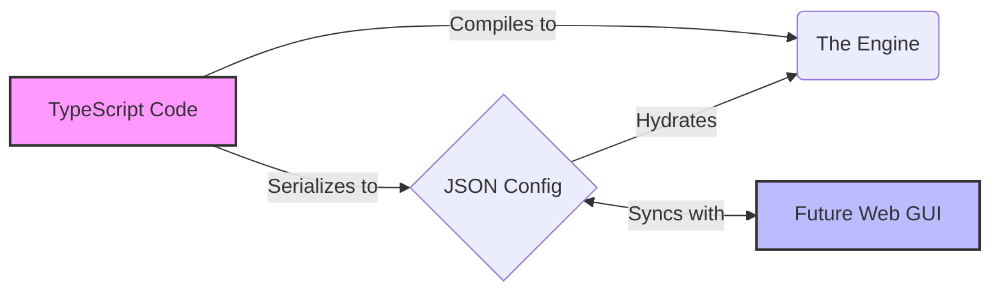

# 🎒 BackpackFlow

A TypeScript-first, config-driven LLM framework built on top of [PocketFlow](https://github.com/The-Pocket/PocketFlow-Typescript).

**BackpackFlow** extends PocketFlow with a specific philosophy: **The Code is the Engine, the Config is the Steering Wheel.**

[](https://badge.fury.io/js/backpackflow)
[](https://opensource.org/licenses/Apache-2.0)

> **⚠️ Work in Progress**: This is a side project under active development. APIs are bound to change as we build toward v2.0. Use at your own risk!

---

## 🚫 The Pain Points (Why BackpackFlow Exists)

Most LLM development hits three major walls:

### 1. **The "Black Box" State**
In many frameworks, context (history, variables) is handled by "magic." You don't know exactly what the LLM can "see" at any given step. Debugging feels like "doing animal experiments."

### 2. **The "No-Code" Wall**
Visual builders are great for demos, but when you need complex loops or custom logic, you hit a wall. You can't "eject" to code easily, and your flow is trapped in the GUI.

### 3. **The Language Barrier**
Python is great for data science, but if you want to build a **web-based tracer** or a **drag-and-drop UI**, you end up duplicating types between your Python backend and React frontend.

---

## 💡 The BackpackFlow Solution

We solve these pain points with a **TypeScript-First, Config-Driven** architecture.

### 1. "Git for Your Agent's State" (Solves Black Box State)

**Think of Backpack as "Git for your agent's memory."**

Just like Git tracks every code change with commits, Backpack tracks every data change in your agent:

```typescript
// Git workflow           // Backpack workflow
git commit              → backpack.pack('data', value)
git log                 → backpack.getHistory()
git checkout abc123     → backpack.getSnapshotAtCommit('abc123')
git diff                → backpack.diff(before, after)
```

**Why "Backpack"?** Because your agent **carries explicit data** from node to node:
- 🎒 Nothing is hidden - if it's not in the Backpack, the agent can't use it
- 🔍 Every item is **tagged** with who packed it, when, and why
- 🚫 Nodes declare **access permissions** - can't accidentally read debug data or PII
- ⏱️ Complete **audit trail** - trace any data back to its source

**The Result:** Instead of debugging "black box" state mutations, you have:

- ✅ **Immutable History** - Every data change is tracked (like Git commits)
- ✅ **Time-Travel Debugging** - Rewind to any previous state (`git checkout`)
- ✅ **Complete Auditability** - Know exactly who changed what, when (`git blame`)
- ✅ **Access Control** - Nodes declare what they can read/write (unlike SharedStore)

**If Git made code development manageable, Backpack makes agent development manageable.**

### 2. Code-First, UI-Ready (Solves the No-Code Wall)

We are building a "bridge" where **Code** and **Config** are interchangeable.

- **The Engine:** You write complex logic in TypeScript Nodes
- **The Steering Wheel:** The framework serializes your Nodes into JSON Config
- **The Result:** Build a **UI Layer** that can visualize and edit your flow, but allows you to "eject" to raw code whenever needed



### 3. TypeScript-First (Solves the Language Barrier)

Build your backend logic AND your web UI in the same language. Share types, schemas, and validation logic seamlessly.

---

## 📍 Current Status & Roadmap

- **Current Version**: v1.2.0 - Event-driven streaming + Explicit LLM client injection
- **Next Major Release**: v2.0.0 - "The Observable Agent" (Q1 2026)
- **Phase**: Active Development
- **Current Focus**: Backpack architecture, Telemetry system, Config serialization

👉 **[See Full Roadmap](./ROADMAP.md)** - Detailed v2.0 feature breakdown and timeline

## ✨ Features

### Current Version (v1.2.0)

- **🤖 Intelligent Agents**: Pre-built `AgentNode` with decision-making, tool calling, and response generation
- **📡 Event-Driven Streaming**: Real-time progress updates and response streaming with type-safe events
- **🔧 MCP Integration**: Native support for the **Model Context Protocol** to discover and connect tools
- **🎯 Multi-Provider Support**: OpenAI, Azure OpenAI, and extensible provider system
- **⚡ Explicit Client Injection**: Full control over LLM clients for better testing and configuration
- **📘 TypeScript First**: Full TypeScript support with type safety

### 🚧 Coming in v2.0 (Q1 2026)

**The Observable Agent Release** - Three foundational systems working together:

#### 🎒 [PRD-001: Backpack Architecture](./docs/prds/PRD-001-backpack-architecture.md)
- **Scoped State Management**: Nodes declare what they can read/write - no more "junk drawer" context
- **Source Tracking**: Every piece of data carries metadata (who added it, when, why)
- **Time-Travel Debugging**: Snapshot state at any point to see exactly what the agent "knew"
- **State Sanitization**: Failed operations don't leak into downstream nodes

#### 📡 [PRD-002: Standardized Telemetry](./docs/prds/PRD-002-telemetry-system.md)
- **Automatic Event Emission**: See lifecycle events (`NODE_START`, `PREP`, `EXEC`, `END`) without writing logging code
- **Debug Prompts**: Inspect exact prompts sent to LLMs via `PREP_COMPLETE` events
- **Parse Error Visibility**: See raw LLM responses before JSON parsing fails
- **Flow Visualization**: Export events to build visual debuggers and tracers

#### 🔌 [PRD-003: Serialization Bridge](./docs/prds/PRD-003-serialization-bridge.md)
- **Config-Driven Nodes**: Instantiate flows from JSON (enables drag-and-drop UIs)
- **Type-Safe Configs**: Zod-validated schemas prevent broken deployments
- **Dependency Injection**: Handle non-serializable objects (LLM clients) cleanly
- **A/B Testing**: Swap node configs dynamically without code changes

## Project Structure

```
backpackflow/
├── src/                    # Source code
│   ├── pocketflow.ts      # PocketFlow core (ported)
│   └── index.ts           # Main entry point
├── tests/                  # Test files
├── tutorials/              # Learning guides and examples
├── dist/                   # Compiled output
└── docs/                   # Documentation
```

## Installation

```bash
npm install backpackflow
```

## Quick Start

### Basic Chat Node (Original)

```typescript
import { ChatNode } from 'backpackflow/nodes';
import { OpenAIProvider } from 'backpackflow/providers';
import { Flow } from 'backpackflow';

// Create an LLM provider
const llmProvider = new OpenAIProvider({
    apiKey: process.env.OPENAI_API_KEY
});

// Create a chat node
const chatNode = new ChatNode({
    llmProvider,
    systemMessage: 'You are a helpful assistant.'
});

// Use it in a flow
const flow = new Flow(chatNode);
await flow.run(storage);
```

### 🚀 New: Intelligent Agent with Tools (v1.2.0)

```typescript
import { 
    AgentNode, 
    MCPServerManager, 
    createInstructorClient,
    EventStreamer,
    StreamEventType 
} from 'backpackflow';

// 1. Create LLM client (explicit injection)
const instructorClient = createInstructorClient({ provider: 'openai' });

// 2. Set up tool integration (optional)
const mcpManager = new MCPServerManager();
await mcpManager.connectToServers([/* your MCP servers */]);
const availableTools = await mcpManager.discoverTools();

// 3. Create intelligent agent
const salesAgent = new AgentNode({
    llmConfig: {
        instructorClient: instructorClient
    },
    agentName: 'SalesAgent',
    eventStreamer: new EventStreamer(),
    namespace: 'sales_agent'
});

// 4. Set up real-time event streaming (optional)
const eventStreamer = new EventStreamer();
eventStreamer.subscribe('sales_agent', (event) => {
    switch (event.type) {
        case StreamEventType.PROGRESS:
            console.log(`🔄 ${event.nodeId}: ${JSON.stringify(event.content)}`);
            break;
        case StreamEventType.CHUNK:
            process.stdout.write(event.content.chunk); // Real-time response
            break;
        case StreamEventType.FINAL:
            console.log(`✅ Final: ${event.content.content}`);
            break;
    }
});

// 5. Execute with shared storage
const sharedStorage = {
    messages: [{ role: 'user', content: 'Generate a quote for 10A MCB' }],
    available_tools: availableTools,
    tool_manager: mcpManager
};

const result = await salesAgent.exec(sharedStorage);
console.log('Agent response:', result.finalAnswer);
```

### Azure OpenAI Support

```typescript
import { createInstructorClient } from 'backpackflow';

// Azure OpenAI configuration
const azureClient = createInstructorClient({
    provider: 'azure',
    apiKey: process.env.AZURE_OPENAI_API_KEY,
    endpoint: process.env.AZURE_OPENAI_ENDPOINT,
    deploymentName: 'gpt-4' // Your deployment name
});

const agent = new AgentNode({
    llmConfig: { instructorClient: azureClient },
    agentName: 'AzureAgent',
    eventStreamer: new EventStreamer(), // Optional streaming
    namespace: 'azure_agent'
});
```

## Development

```bash
# Install dependencies
npm install

# Build the project
npm run build

# Development mode (watch for changes)
npm run dev
```

## Learning & Examples

🎓 **New to BackpackFlow?** Start with our comprehensive tutorial series:

- **[Simple Sales Agent](./tutorials/simple-sales-agent/)** - 🆕 Complete agent with tool integration and streaming (v1.2.0)
- **[Building AI from First Principles](./tutorials/building-ai-from-first-principles/)** - Learn by building real AI applications
- **[Part 1: Foundations](./tutorials/building-ai-from-first-principles/01-foundations/)** - From API calls to conversations
- **[Simple Chatbot Tutorial](./tutorials/simple-chatbot/)** - Build your first AI chatbot

### Advanced Examples
- **[PocketFlow Cookbook](./tutorials/pocketflow-cookbook-ts/)** - Advanced patterns and workflows

See the `tutorials/` directory for complete learning guides and usage examples.

## 📋 What's New

### v1.2.0 (Latest) - Event-Driven Architecture + Explicit Client Injection
- ✅ **Explicit LLM Client Injection**: Full control over LLM clients for better testing and configuration
- ✅ **Enhanced Event Streaming**: Type-safe `StreamEventType` enum for better event handling
- ✅ **Azure OpenAI Support**: Native support for Azure OpenAI endpoints
- ✅ **Improved AgentNode**: Simplified configuration with better defaults
- ✅ **Better Error Handling**: Enhanced error reporting and debugging
- ✅ **Code Cleanup**: Removed console.log statements in favor of event emissions

### v1.1.0 - Event-Driven Streaming
- ✅ **EventStreamer**: Centralized event management with namespace support
- ✅ **Real-time Streaming**: Live progress updates and response streaming
- ✅ **AgentNode**: High-level agent orchestration with tool integration

### v1.0.x - Initial Release
- ✅ **Core Framework**: Basic PocketFlow integration and node system
- ✅ **LLM Providers**: OpenAI integration and provider abstraction
- ✅ **Basic Nodes**: Chat, Decision, and utility nodes

## 🤝 Join the Community

Want to contribute, get help, or share what you're building? 

👉 **[Join our community](./tutorials/building-ai-from-first-principles/JOIN_COMMUNITY.md)** - Connect with other developers building AI applications

## 🛠️ Contributing

This is a personal side project that I work on as time permits. While contributions are welcome, please understand that development pace may be irregular and APIs may change frequently as the project evolves.

### Want to Help Build v2.0?

We're actively working on three major features. Pick one that matches your interests:

1. **[PRD-001: Backpack Architecture](./docs/prds/PRD-001-backpack-architecture.md)** - State management (no LLM knowledge needed)
2. **[PRD-002: Telemetry System](./docs/prds/PRD-002-telemetry-system.md)** - Observability & event streaming
3. **[PRD-003: Serialization Bridge](./docs/prds/PRD-003-serialization-bridge.md)** - Config system (good for first-time contributors)

👉 **[See the Roadmap](./ROADMAP.md)** for detailed task breakdowns and timelines.

## License

Apache-2.0 - see the [LICENSE](LICENSE) file for details.

Copyright 2024 BackpackFlow 