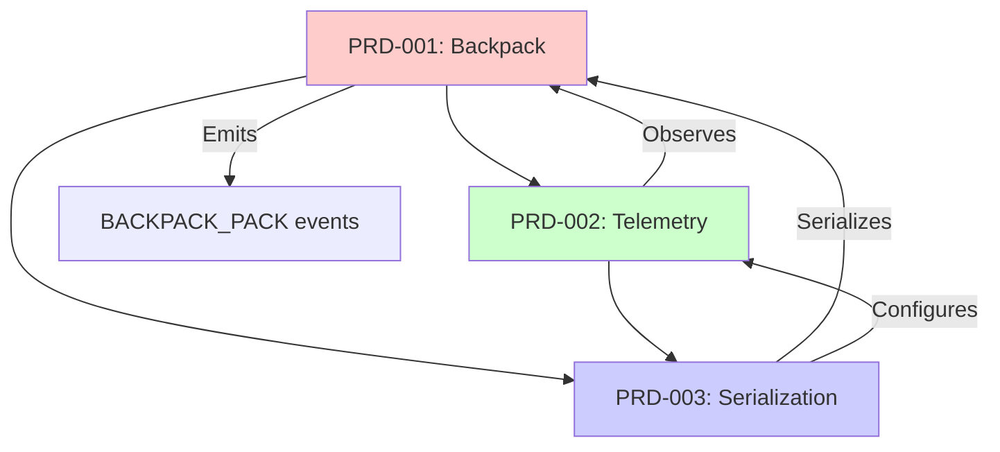

# 🗺️ BackpackFlow Roadmap

**Last Updated:** December 17, 2025  
**Current Version:** v1.2.0  
**Next Major Release:** v2.0.0

---

## Vision Statement

Transform BackpackFlow from a code-only library into an **observable, config-ready engine** that solves the three critical pain points in AI agent development:

1. **The "Black Box" Crisis** → Solved by Telemetry (PRD-002)
2. **The "Junk Drawer" Problem** → Solved by Backpack Architecture (PRD-001)
3. **The "No-Code Wall"** → Solved by Serialization Bridge (PRD-003)

---

## Release Plan: v2.0.0 "The Observable Agent"

**Target Release Date:** Q1 2026  
**Release Goal:** Ship all three foundational systems together as a cohesive update.

### Why Release Together?

These three systems are deeply interconnected:

**Dependency Order:**
1. **Backpack** is the foundation (state management)
2. **Telemetry** observes Backpack mutations
3. **Serialization** requires both to serialize state + event config

**Integration Points:**
- Backpack emits `BACKPACK_PACK`/`BACKPACK_UNPACK` events (Telemetry)
- Backpack must be serializable via `toJSON()` (Serialization)
- EventStreamer must be configurable via JSON (Serialization)

**Decision:** Releasing separately would create a fragmented API. Users would need to migrate twice. Better to release as one coherent v2.0.

---

## Feature Breakdown

### 🎒 PRD-001: Backpack Architecture

**Owner:** [TBD]  
**Priority:** P0 (Foundation)  
**Status:** Not Started  
**Document:** [PRD-001-backpack-architecture.md](./docs/prds/PRD-001-backpack-architecture.md)

#### Problem Solved
Eliminates "Context Pollution" where shared state becomes a junk drawer of stale/corrupted data.

#### Key Deliverables
- ✅ `Backpack` class with `.pack()` / `.unpack()` API
- ✅ Metadata tracking (source node, timestamp, version)
- ✅ Immutable commit history for time-travel debugging
- ✅ Scoped access control (nodes declare read/write permissions)
- ✅ Sanitization API to quarantine failed data

#### Success Metrics
- **State Sanitization Test:** Failed tool results don't leak to downstream nodes
- **Source Tracing Test:** Can identify which node added incorrect data
- **Time-Travel Test:** `getSnapshot(timestamp)` returns exact historical state
- **Performance:** < 5ms overhead per node

#### Estimated Effort
4 weeks (1 engineer)

---

### 📡 PRD-002: Standardized Telemetry System

**Owner:** [TBD]  
**Priority:** P0 (Foundation)  
**Status:** Not Started  
**Document:** [PRD-002-telemetry-system.md](./docs/prds/PRD-002-telemetry-system.md)

#### Problem Solved
Eliminates the "Black Box" debugging nightmare by automatically emitting lifecycle events.

#### Key Deliverables
- ✅ `BackpackEvent` schema (strongly-typed envelope)
- ✅ Lifecycle events: `NODE_START`, `PREP_COMPLETE`, `EXEC_COMPLETE`, `NODE_END`, `ERROR`
- ✅ Backpack events: `BACKPACK_PACK`, `BACKPACK_UNPACK`
- ✅ `EventStreamer` class for subscribing to events
- ✅ `BackpackNode` base class that auto-emits events

#### Success Metrics
- **No-Code Logging Test:** See all lifecycle events without writing `console.log`
- **Debug Prompt Test:** Inspect `PREP_COMPLETE` to see exact LLM prompt
- **Parse Error Test:** Inspect `EXEC_COMPLETE` to see raw LLM response before parsing
- **Performance:** < 2ms overhead per event

#### Estimated Effort
3 weeks (1 engineer)

---

### 🔌 PRD-003: Serialization Bridge

**Owner:** [TBD]  
**Priority:** P1 (Enabler)  
**Status:** Not Started  
**Document:** [PRD-003-serialization-bridge.md](./docs/prds/PRD-003-serialization-bridge.md)

#### Problem Solved
Enables "Low-Code" workflows by making nodes instantiable from JSON configs.

#### Key Deliverables
- ✅ `NodeConfig` and `FlowConfig` schemas (Zod-validated)
- ✅ `DependencyContainer` for injecting non-serializable objects (LLM clients)
- ✅ `SerializableNode` interface with `toConfig()` / `fromConfig()`
- ✅ `FlowLoader` class for loading flows from JSON
- ✅ Serialization support for all built-in nodes

#### Success Metrics
- **No-Code Test:** Load a 3-node flow from JSON and run it
- **Round-Trip Test:** `fromConfig(toConfig())` produces identical node
- **Type Safety Test:** Invalid configs throw Zod validation errors
- **A/B Test:** Swap configs dynamically without code changes

#### Estimated Effort
4 weeks (1 engineer)

---

## Development Phases

> **Note:** Timeline is flexible - complete phases at your own pace. Estimates removed since this is a solo project.

### Phase 1: Backpack Core (PRD-001)

**Goal:** Build the Backpack core without breaking existing APIs.

**Tasks:**
- [ ] Create `Backpack` class in `src/storage/backpack.ts`
- [ ] Implement `.pack()`, `.unpack()`, `.unpackRequired()` methods
- [ ] Add metadata tracking (source, timestamp, version, namespace)
- [ ] Implement commit history (`_history` array)
- [ ] Add access control via permissions object
- [ ] Implement namespace wildcard matching
- [ ] Write unit tests for all Backpack methods

**Parallel Work:**
- [ ] Define event schemas in `src/types/events.ts` (prep for Phase 2)

**Milestone:** `Backpack` class passes all unit tests, ready for integration.

---

### Phase 2: Telemetry System (PRD-002)

**Goal:** Create `BackpackNode` that auto-emits events.

**Tasks:**
- [ ] Define all payload interfaces in `src/types/events.ts`
- [ ] Enhance `EventStreamer` class (already exists, needs v2.0 updates)
- [ ] Create `BackpackNode` base class in `src/nodes/backpack-node.ts`
- [ ] Override `_run()` to emit lifecycle events
- [ ] Integrate Backpack events (`BACKPACK_PACK`, `BACKPACK_UNPACK`)
- [ ] Add wildcard pattern matching to EventStreamer
- [ ] Add event buffer for history
- [ ] Write integration tests (node + backpack + events)

**Parallel Work:**
- [ ] Start defining `NodeConfig` schemas (prep for Phase 3)

**Milestone:** `BackpackNode` emits all lifecycle events correctly. Example console tracer works.

---

### Phase 3: Serialization Bridge (PRD-003)

**Goal:** Make nodes loadable from JSON.

**Tasks:**
- [ ] Define `NodeConfig`, `FlowConfig`, `FlowEdge` TypeScript types
- [ ] Create Zod schemas for validation
- [ ] Implement `DependencyContainer` in `src/config/dependencies.ts`
- [ ] Create `FlowLoader` in `src/config/flow-loader.ts`
- [ ] Add `toConfig()` / `fromConfig()` to `BackpackNode`
- [ ] Implement serialization for built-in nodes:
  - [ ] `ChatNode`
  - [ ] `AgentNode`
  - [ ] `DecisionNode`
  - [ ] `ToolExecutionNode`
- [ ] Create example JSON configs in `examples/configs/`
- [ ] Write round-trip tests

**Milestone:** Can load and run a multi-node flow from JSON. Round-trip serialization works.

---

### Phase 4: Migration & Documentation

**Goal:** Migrate existing examples and document the new APIs.

**Tasks:**
- [ ] Update all tutorials to use `Backpack` instead of `SharedStorage`
- [ ] Update all examples to use `BackpackNode`
- [ ] Update migration guide with real examples
- [ ] Write comprehensive API docs
- [ ] Create video walkthrough: "Building with Backpack"
- [ ] Update README with new capabilities

**Milestone:** All examples run on v2.0 APIs. Documentation complete.

---

### Phase 5: Testing & Release

**Goal:** Production-ready release.

**Tasks:**
- [ ] End-to-end testing with real LLM flows
- [ ] Performance benchmarking
- [ ] Security audit (especially config validation)
- [ ] Fix all critical bugs
- [ ] Prepare release notes

**Milestone:** v2.0.0 release candidate ready.

---

## Post-v2.0 Roadmap

### v2.1: Enhanced Observability (Q2 2026)

- **Web-Based Tracer UI** (Visualize events in browser)
- **Event Persistence** (Save traces to database)
- **Trace Replay** (Rerun flows from event logs)

### v2.2: Advanced Config Features (Q3 2026)

- **Config Migrations** (Auto-upgrade v1 → v2 configs)
- **Conditional Edges** (JSON Logic for complex routing)
- **Config Hot-Reloading** (Swap configs in running agents)

### v3.0: Multi-Agent Orchestration (Q4 2026)

- **Distributed Backpack** (Cross-process state sharing)
- **Agent-to-Agent Communication** (Message passing)
- **Hierarchical Flows** (Supervisor/worker patterns)

---

## Dependencies & Blockers

### External Dependencies

| Dependency | Purpose | Status |
|------------|---------|--------|
| PocketFlow | Base graph engine | ✅ Stable |
| Zod | Config validation | ✅ Available |
| OpenAI SDK | LLM provider | ✅ Available |
| MCP Protocol | Tool integration | ✅ Available |

### Internal Blockers

| Blocker | Impacts | Resolution |
|---------|---------|------------|
| Need to finalize Backpack API | All PRDs | **Week 1** design review |
| Unclear PocketFlow `_run()` signature | PRD-002 | **Week 2** code review |
| JSON schema versioning strategy | PRD-003 | **Week 8** architecture decision |

---

## Success Metrics (v2.0 Launch)

### Adoption Metrics
- **GitHub Stars:** +500 (from current ~100)
- **npm Downloads:** 1,000/month (from current ~50/month)
- **Community:** 50+ Discord members

### Technical Metrics
- **Test Coverage:** > 85%
- **Performance:** < 10ms total overhead (Backpack + Events)
- **API Stability:** Zero breaking changes in v2.x patch releases

### Content Metrics (Tied to Master File Strategy)
- **YouTube Channel:** 100+ subscribers
- **Tutorial Engagement:** 500+ views on "Building with Backpack" video
- **Community Projects:** 3+ community-built nodes

---

## Architectural Decisions

### AD-001: Node Namespaces (Added Dec 2025)

**Decision:** Add optional `namespace` field to all nodes.

**Rationale:**
- **Human-Readable Event Filtering:** `subscribe('sales.*')` vs UUID-based filtering
- **Semantic Access Control:** `namespaceRead: ['auth.*']` in Backpack permissions
- **Hierarchical Organization:** Support nested flows (`parent.child.grandchild`)
- **Future-Proof:** Essential for v3.0 multi-agent coordination

**Impact:**
- PRD-001: Add `sourceNamespace` to `BackpackItem` metadata
- PRD-002: Add `namespace` field to `BackpackEvent`, support wildcard subscription
- PRD-003: Add `namespace` field to `NodeConfig`

**Implementation:**
- Namespaces are **optional** (not required for basic usage)
- Format: Dot-separated paths (e.g., `"sales.research.chat"`)
- Wildcards: Single-level (`sales.*`) in v2.0, deep matching (`sales.**`) in v2.1

---

## Architectural Decisions (Continued)

### AD-002: Backpack API - Hybrid Error Handling (Dec 2025)

**Decision:** Provide both `unpack()` (returns `undefined`) and `unpackRequired()` (throws).

**Rationale:**
- Optional data (cache, preferences) → use `unpack()`, check for undefined
- Required data (user query, config) → use `unpackRequired()`, fail fast
- TypeScript enforces null-checking only where needed

### AD-003: Event Emission Strategy (Dec 2025)

**Decision:** Use Node.js `EventEmitter` as foundation, wrap for BackpackFlow features.

**Rationale:**
- **Leverage battle-tested library:** EventEmitter is performant, well-documented
- **Add only what's needed:** Wildcard matching, type safety, event history
- **Minimal wrapper:** ~100 lines vs. full pub/sub implementation
- **Easy migration:** Current v1.2.0 `EventStreamer` already extends `EventEmitter`

**Emission Strategy:** Synchronous emission, async handler support (fire-and-forget).
- Events captured before node completes (critical for debugging)
- Async handlers (webhooks, DB writes) don't block flow
- Overhead: < 0.5ms for in-memory, network I/O happens in background

### AD-004: Edge Conditions - Start Simple (Dec 2025)

**Decision:** String-based conditions in v2.0, JSON Logic in v2.1.

**Rationale:**
- v2.0: Simple routing (e.g., "approve" → sales-node)
- v2.1: Complex logic (e.g., confidence > 0.7 AND vipCustomer)
- Progressive enhancement: don't over-engineer for v2.0

---

## Open Questions

**Q1:** Should we support legacy `SharedStorage` in v2.0 or force migration?  
**Decision:** ✅ **Force migration.** v2.0 = breaking changes allowed. Clean break, no backwards compatibility needed.

**Q2:** How do we handle breaking changes in PocketFlow upstream?  
**Proposal:** Pin PocketFlow to specific version, document upgrade path.

**Q3:** Should Backpack access control be opt-in or mandatory?  
**Proposal:** Opt-in for v2.0 (default = no restrictions), mandatory in v3.0.

**Q4:** Should namespace inheritance happen automatically in nested flows?  
**Proposal:** Start with manual namespaces in v2.0, add auto-inheritance in v2.1 when we have sub-flow support.

---

## Contributing

See individual PRDs for detailed task lists. Key contribution areas:

1. **PRD-001:** Implement Backpack core (TypeScript, no LLM knowledge needed)
2. **PRD-002:** Build event streaming (Good for observability experts)
3. **PRD-003:** Create node serializers (Good for first-time contributors)

**Contact:** [Your contact info / Discord link]

---

**Related Documents:**
- [PRD-001: Backpack Architecture](./docs/prds/PRD-001-backpack-architecture.md)
- [PRD-002: Telemetry System](./docs/prds/PRD-002-telemetry-system.md)
- [PRD-003: Serialization Bridge](./docs/prds/PRD-003-serialization-bridge.md)
- [Original PRD](./docs/prds/PRD-legacy.md) *(Deprecated - superseded by PRD-001/002/003)*
- [Migration Guide v1→v2](./docs/architecture/MIGRATION-v1-to-v2.md)

