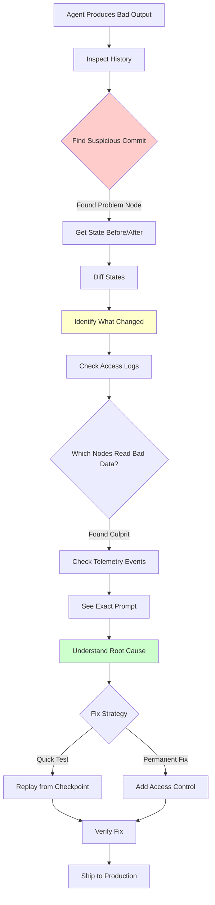

# Backpack Debugging Workflow

**How observability and time-travel debugging actually work in practice**

---

## The Problem: Agent Produces Bad Output

```typescript
const backpack = new Backpack();
backpack.pack('userQuery', 'Generate a sales quote for 10A MCB');

const result = await salesAgentFlow.run(backpack);
const finalAnswer = backpack.unpack('finalAnswer');

// ❌ Output is garbage: "I don't have enough information"
// But we provided all the necessary data!
```

---

## 🔍 Step-by-Step Debugging

### Step 1: Inspect the History

**Goal:** See what happened in chronological order.

```typescript
const history = backpack.getHistory();
console.table(history);
```

**Output:**
```
┌─────┬──────────────┬───────────────────┬────────────┬────────┬──────────────────┐
│ idx │ timestamp    │ nodeId            │ action     │ key    │ valueSummary     │
├─────┼──────────────┼───────────────────┼────────────┼────────┼──────────────────┤
│ 0   │ 1734567890000│ decision-1        │ pack       │ intent │ "sales_quote"    │
│ 1   │ 1734567891000│ research-1        │ pack       │ context│ "MCB specs..."   │
│ 2   │ 1734567892000│ validation-1      │ pack       │ error  │ "Invalid input"  │ 👈 Suspicious!
│ 3   │ 1734567893000│ research-2        │ unpack     │ context│ [accessed]       │
│ 4   │ 1734567894000│ chat-1            │ pack       │ response│ "I don't know..." │
└─────┴──────────────┴───────────────────┴────────────┴────────┴──────────────────┘
```

**Observation:** `validation-1` added an `error` key at step 2. Did downstream nodes see this?

---

### Step 2: Compare States (Before/After Problem Node)

**Goal:** See exactly what changed.

```typescript
// Get state before validation-1 ran
const beforeValidation = backpack.getSnapshotBeforeNode('validation-1');

// Get state after validation-1 ran
const afterValidation = backpack.getSnapshotAtCommit(history[2].commitId);

// Compare
const diff = backpack.diff(beforeValidation, afterValidation);
console.log(diff);
```

**Output:**
```json
{
  "added": ["error"],
  "modified": [],
  "deleted": [],
  "details": {
    "error": {
      "before": undefined,
      "after": "Invalid input: Missing product code",
      "changedBy": "validation-1"
    }
  }
}
```

**Finding:** The `error` key was added to the Backpack. Did `chat-1` accidentally read it?

---

### Step 3: Check What Nodes Actually Read

**Goal:** See what data each node accessed.

```typescript
// What did chat-1 read?
const chatReads = backpack.getAccessLog('chat-1', 'read');
console.log('chat-1 read these keys:', chatReads);
```

**Output:**
```javascript
['userQuery', 'context', 'error']  // 👈 AHA! It read the error key!
```

**Root Cause Found:** 
- `validation-1` added an error to the Backpack
- `chat-1` read EVERYTHING in the Backpack (including the error)
- The LLM saw "Invalid input" and refused to generate a quote

---

### Step 4: Visualize the Exact Prompt (via PRD-002 Telemetry)

**Goal:** See the exact prompt sent to the LLM.

```typescript
// From EventStreamer (PRD-002)
eventStreamer.subscribe('chat-1', (event) => {
    if (event.type === 'PREP_COMPLETE') {
        console.log('Exact prompt sent to LLM:');
        console.log(event.payload.prepResult);
    }
});
```

**Output:**
```
Exact prompt sent to LLM:
─────────────────────────
System: You are a sales assistant.

User Query: Generate a sales quote for 10A MCB

Context: MCB specifications: 10A, 240V, Type B...

Error: Invalid input: Missing product code  👈 LLM saw this!
─────────────────────────
```

**Confirmed:** The error message was included in the prompt, confusing the LLM.

---

## 🔧 Step 5: Fix & Replay

### Fix Option 1: Scope Access (Backpack Feature)

```typescript
class ChatNode extends BackpackNode {
    permissions = {
        read: ['userQuery', 'context'],  // ✅ Don't read 'error'
        deny: ['error']                  // ✅ Explicitly block
    };
}
```

### Fix Option 2: Replay from Checkpoint

```typescript
// Get the state BEFORE validation added the error
const cleanState = backpack.getSnapshotBeforeNode('validation-1');

// Skip the validation node, run the rest
const fixedFlow = new Flow();
fixedFlow.addNode(research2);
fixedFlow.addNode(chat1);

const result = await fixedFlow.run(cleanState);
// ✅ Now chat-1 doesn't see the error!
```

---

## 📊 Visualization: The Complete Debugging Flow



---

## 🎯 Real-World Example: Multi-Agent Coordination Bug

### Scenario
You have 3 agents:
1. **Researcher** - Gathers data
2. **Analyzer** - Processes data  
3. **Reporter** - Writes final report

**Problem:** Reporter produces wrong conclusion.

### Debug Steps

**1. History shows all 3 agents:**
```javascript
[
  { nodeId: 'researcher-1', key: 'findings', ... },
  { nodeId: 'analyzer-1', key: 'analysis', ... },
  { nodeId: 'analyzer-1', key: 'findings', ... },  // 👈 Overwrote original!
  { nodeId: 'reporter-1', key: 'report', ... }
]
```

**2. Compare states:**
```typescript
const beforeAnalyzer = backpack.getSnapshotBeforeNode('analyzer-1');
const afterAnalyzer = backpack.getSnapshotAtCommit(history[2].commitId);

const diff = backpack.diff(beforeAnalyzer, afterAnalyzer);
console.log(diff.modified);  // ['findings']
```

**Finding:** Analyzer overwrote Researcher's findings!

**3. Replay to test fix:**
```typescript
// Namespace isolation fix
const researcher = new ResearchNode({ namespace: 'research' });
const analyzer = new AnalyzerNode({ namespace: 'analysis' });

researcher.pack('findings', data);  // Key: 'research.findings'
analyzer.pack('findings', data);    // Key: 'analysis.findings'

// No collision! ✅
```

---

## 💡 Key Takeaways

### 1. **Timestamp is NOT the entry point**
You don't start with timestamps. The workflow is:
1. Look at **history** (commit log)
2. Identify **suspicious commit**
3. Use commit ID or node ID to get snapshot
4. Timestamps are internal - you never type them manually

### 2. **Multiple Debugging Layers**
- **Backpack History** - What changed, when, by whom
- **Access Logs** - What each node actually read
- **Event Telemetry** (PRD-002) - Exact prompts sent to LLMs
- **Diffs** - Before/after comparison

### 3. **Replay Enables Fast Iteration**
Instead of re-running the entire 20-step flow:
1. Get checkpoint before the problem
2. Rerun just the problematic nodes
3. Test fixes quickly

### 4. **Works with Telemetry (PRD-002)**
```typescript
// Backpack tells you WHAT changed
const diff = backpack.diff(before, after);

// Telemetry tells you WHY (the prompt)
const promptEvent = streamer.getEvents({ 
    nodeId: 'chat-1', 
    type: 'PREP_COMPLETE' 
})[0];
```

---

## 🚀 Implementation Priority

Based on debugging workflow, implement in this order:

### Phase 1 (Must-Have):
1. ✅ `getHistory()` - See the commit log
2. ✅ `getSnapshotAtCommit()` - Jump to specific point
3. ✅ `getAccessLog()` - See what nodes read

### Phase 2 (High Value):
4. ✅ `getSnapshotBeforeNode()` - Ergonomic API
5. ✅ `diff()` - State comparison

### Phase 3 (Nice-to-Have):
6. Checkpoint/replay system
7. Visual timeline (Web UI)
8. Automated anomaly detection

---

**Summary:** Time-travel debugging is practical because you **inspect history first**, then jump to specific points using commit/node IDs. Timestamps are internal metadata, not a UX entry point.

