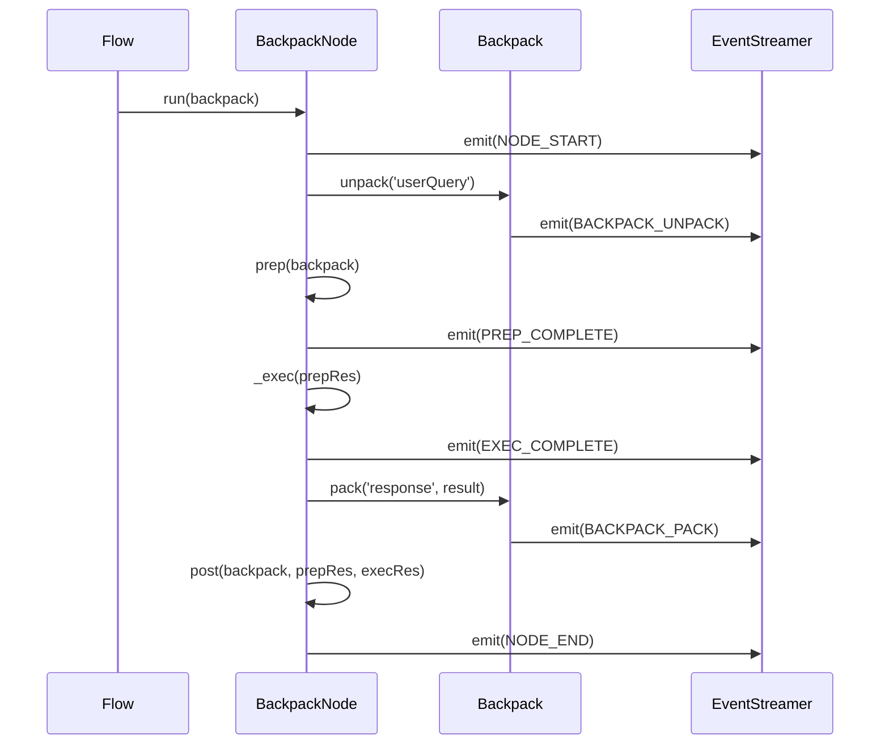

# PRD-002: Standardized Telemetry System

**Status:** Draft  
**Priority:** P0 (Foundation)  
**Target Release:** v2.0.0  
**Dependencies:** PRD-001 (Backpack Architecture)  
**Blocks:** None

---

## 1. Problem Statement

### The "Black Box" Crisis

Current BackpackFlow (and most AI frameworks) suffer from the **Observability Paradox**: As agents get smarter, they become harder to debug.

**1.1 No Standard Observability**

- No built-in way to see what a node is doing in real-time
- Developers resort to `console.log()` scattered everywhere
- Each node implements logging differently

**1.2 The "Animal Experiment" Problem**

Developers describe debugging LLM agents as "doing animal experiments":
- You can't see what the agent is "thinking"
- You can't inspect the exact prompt sent to the LLM
- When JSON parsing fails, you can't see the raw LLM response

**1.3 No UI Integration Path**

Without standardized events, building a web-based tracer or debugger requires custom instrumentation for every node type.

---

## 2. Solution: Standardized Event Streaming

### Core Concept

Automatically emit **strongly-typed lifecycle events** at every phase of a node's execution, exposing the "transformation pipeline" to external observers.

**Key Insight:** Every node follows the same lifecycle:
```
NODE_START → PREP → EXEC → POST → NODE_END
```

By intercepting this lifecycle in the `BackpackNode` base class, we get **automatic observability** without boilerplate.

---

## 3. Technical Specification

### 3.1 Event Schema

#### The Event Envelope

All events follow this structure:

```typescript
export interface BackpackEvent {
    id: string;             // UUID
    timestamp: number;      // Unix Epoch (ms)
    sourceNode: string;     // Node Name (e.g., "ChatNode")
    nodeId: string;         // Instance ID (UUID)
    namespace?: string;     // Semantic path (e.g., "sales.research.chat")
    runId: string;          // Correlation ID for the entire flow
    type: StreamEventType;
    payload: EventPayload;  // Strongly-typed per event type
}
```

#### Event Types

```typescript
export enum StreamEventType {
    // Lifecycle (Automatic)
    NODE_START = 'node_start',
    PREP_COMPLETE = 'prep_complete',
    EXEC_COMPLETE = 'exec_complete',
    NODE_END = 'node_end',
    ERROR = 'error',
    
    // Backpack Operations (Automatic)
    BACKPACK_PACK = 'backpack_pack',
    BACKPACK_UNPACK = 'backpack_unpack',
    
    // Custom (Manual inside exec)
    STREAM_CHUNK = 'stream_chunk',    // For token streaming
    TOOL_CALL = 'tool_call',          // When an agent calls a tool
    CUSTOM = 'custom'                 // Generic payload
}
```

### 3.2 Lifecycle Event Payloads

#### 1. NODE_START

**Trigger:** Start of `_run()` method  
**Purpose:** "I am starting with these settings"

```typescript
export interface NodeStartPayload {
    nodeName: string;         // e.g., "ChatNode"
    nodeId: string;           // UUID for this instance
    params: Record<string, any>; // Node configuration
    backpackSnapshot: Record<string, any>; // Current Backpack state
}
```

#### 2. PREP_COMPLETE

**Trigger:** After `prep(shared)` returns  
**Purpose:** "This is the prompt/data I prepared for the LLM"

```typescript
export interface PrepCompletePayload {
    prepResult: unknown;      // The exact data prepared
                              // CRITICAL: Usually the LLM prompt!
    backpackReads: string[];  // Keys unpacked during prep
}
```

**Why This Matters:** In 90% of LLM bugs, the issue is "What exactly did I send to the model?" This event exposes the exact prompt.

#### 3. EXEC_COMPLETE

**Trigger:** After `_exec(prepRes)` returns  
**Purpose:** "This is the raw result I got back"

```typescript
export interface ExecCompletePayload {
    execResult: unknown;      // Raw LLM response (before parsing)
    attempts: number;         // Retry count (from PocketFlow's retry logic)
    durationMs: number;       // Execution time
}
```

**Why This Matters:** If JSON parsing fails in `post()`, this event shows the raw string the LLM actually returned (often "I'm sorry, I can't do that...").

#### 4. NODE_END

**Trigger:** After `post()` returns  
**Purpose:** "I am done. This is the path I took"

```typescript
export interface NodeEndPayload {
    action: string | undefined; // The 'Action' string (e.g., "default", "error")
                                // Used for flow visualization
    backpackWrites: string[];   // Keys packed during this node
    durationMs: number;         // Total node execution time
}
```

**Why This Matters:** The `action` tells your tracer UI which edge to highlight in the graph visualization.

#### 5. ERROR

**Trigger:** Inside catch block of `_run()`  
**Purpose:** "Something failed at this phase"

```typescript
export interface ErrorPayload {
    phase: 'prep' | 'exec' | 'post';
    error: string;            // error.message
    stack?: string;           // Full stack trace
    backpackStateAtError: Record<string, any>; // State when error occurred
}
```

### 3.3 Backpack Event Payloads (NEW)

These events are emitted by the Backpack itself (from PRD-001):

#### BACKPACK_PACK

```typescript
export interface BackpackPackPayload {
    key: string;
    valueSummary: string;     // Truncated for large values
    metadata: {
        sourceNodeId: string;
        timestamp: number;
        tags?: string[];
    };
}
```

#### BACKPACK_UNPACK

```typescript
export interface BackpackUnpackPayload {
    key: string;
    requestingNodeId: string;
    accessGranted: boolean;   // False if access denied
    reason?: string;          // If denied, why?
}
```

### 3.4 Event Lifecycle Sequence



---

## 4. Implementation Plan

### 4.1 The `EventStreamer` Class

**Implementation Strategy:** Use Node.js `EventEmitter` as the foundation, wrap it for BackpackFlow-specific features.

```typescript
import { EventEmitter } from 'events';

export class EventStreamer {
    private emitter: EventEmitter;           // Use built-in EventEmitter!
    private eventBuffer: BackpackEvent[];    // For history/debugging
    private subscriptions: Map<string, Set<EventHandler>>;  // Track patterns
    
    constructor(options?: { bufferSize?: number }) {
        this.emitter = new EventEmitter();
        this.emitter.setMaxListeners(100);   // Increase limit for many subscribers
        this.eventBuffer = [];
    }
    
    // Subscribe to specific node, namespace pattern, or all events
    subscribe(
        pattern: string | '*',  // nodeId, namespace pattern, or '*'
        handler: EventHandler
    ): void {
        // Store pattern for matching
        if (!this.subscriptions.has(pattern)) {
            this.subscriptions.set(pattern, new Set());
        }
        this.subscriptions.get(pattern).add(handler);
    }
    
    // Examples:
    // subscribe('e3b0c442-uuid', handler)     → specific node by ID
    // subscribe('sales.chat', handler)        → specific namespace
    // subscribe('sales.*', handler)           → wildcard (all sales nodes)
    // subscribe('*.chat', handler)            → all chat nodes
    // subscribe('*', handler)                 → all events
    
    // Emit event (called by BackpackNode)
    emit(event: BackpackEvent): void {
        // 1. Add to buffer (for history)
        this.addToBuffer(event);
        
        // 2. Find matching subscribers (handle wildcards)
        const handlers = this.getMatchingHandlers(event);
        
        // 3. Call each handler (sync emission, async support)
        for (const handler of handlers) {
            try {
                const result = handler(event);
                if (result instanceof Promise) {
                    result.catch(err => this.handleError(err));
                }
            } catch (err) {
                this.handleError(err);
            }
        }
    }
    
    // Query historical events
    getEvents(filter?: EventFilter): BackpackEvent[];
    
    // Export for visualization
    toJSON(): string;
    
    // Pattern matching (the custom logic we need)
    private getMatchingHandlers(event: BackpackEvent): EventHandler[] {
        const handlers: EventHandler[] = [];
        
        for (const [pattern, patternHandlers] of this.subscriptions) {
            if (this.matches(pattern, event)) {
                handlers.push(...patternHandlers);
            }
        }
        
        return handlers;
    }
    
    private matches(pattern: string, event: BackpackEvent): boolean {
        if (pattern === '*') return true;
        if (pattern === event.nodeId) return true;
        if (pattern === event.namespace) return true;
        
        // Wildcard matching (e.g., "sales.*" matches "sales.chat")
        if (pattern.includes('*')) {
            const regex = new RegExp(
                '^' + pattern.replace(/\./g, '\\.').replace(/\*/g, '[^.]+') + '$'
            );
            return event.namespace ? regex.test(event.namespace) : false;
        }
        
        return false;
    }
}
```

**Why This Approach:**
- ✅ **Leverage existing library:** EventEmitter is battle-tested, performant
- ✅ **Add only what's needed:** Wildcard matching, type safety, history buffer
- ✅ **Simple implementation:** ~100 lines of wrapper code vs. full pub/sub implementation

**Migration from v1.2.0:**
Your current `EventStreamer` already extends `EventEmitter` (good!). For v2.0, we need to:
1. ✅ Keep the `EventEmitter` inheritance (already done)
2. 🔄 Update `StreamEvent` → `BackpackEvent` (add more fields)
3. 🔄 Update `StreamEventType` enum (add lifecycle events)
4. ➕ Add wildcard pattern matching (currently only exact namespace match)
5. ➕ Add event buffer for history/debugging

### 4.2 The `BackpackNode` Base Class

Override `_run()` to inject events:

```typescript
export abstract class BackpackNode extends Node {
    protected eventStreamer?: EventStreamer;
    
    async _run(backpack: Backpack): Promise<Action | undefined> {
        const startTime = Date.now();
        
        // 1. NODE_START
        this.emitEvent(StreamEventType.NODE_START, {
            nodeName: this.constructor.name,
            nodeId: this.id,
            params: this.params,
            backpackSnapshot: backpack.toJSON()
        });
        
        try {
            // 2. PREP
            const p = await this.prep(backpack);
            this.emitEvent(StreamEventType.PREP_COMPLETE, {
                prepResult: p,
                backpackReads: backpack.getAccessLog(this.id, 'read')
            });
            
            // 3. EXEC
            const execStart = Date.now();
            const e = await this._exec(p);
            this.emitEvent(StreamEventType.EXEC_COMPLETE, {
                execResult: e,
                attempts: (this as any).currentRetry || 1,
                durationMs: Date.now() - execStart
            });
            
            // 4. POST
            const action = await this.post(backpack, p, e);
            
            // 5. NODE_END
            this.emitEvent(StreamEventType.NODE_END, {
                action,
                backpackWrites: backpack.getAccessLog(this.id, 'write'),
                durationMs: Date.now() - startTime
            });
            
            return action;
            
        } catch (err) {
            this.emitEvent(StreamEventType.ERROR, {
                phase: this.determinePhase(err),
                error: err.message,
                stack: err.stack,
                backpackStateAtError: backpack.toJSON()
            });
            throw err;
        }
    }
    
    protected emitEvent(type: StreamEventType, payload: any): void {
        if (!this.eventStreamer) return;
        
        this.eventStreamer.emit({
            id: generateUUID(),
            timestamp: Date.now(),
            sourceNode: this.constructor.name,
            nodeId: this.id,
            runId: this.runId,
            type,
            payload
        });
    }
}
```

---

## 5. Usage Examples

### Example 1: Console Tracer with Namespace Filtering

```typescript
const streamer = new EventStreamer();

// Subscribe to all events
streamer.subscribe('*', (event) => {
    const location = event.namespace || event.nodeId;
    console.log(`[${event.type}] ${event.sourceNode} (${location})`);
    
    if (event.type === StreamEventType.PREP_COMPLETE) {
        console.log('Prompt sent to LLM:');
        console.log(event.payload.prepResult);
    }
    
    if (event.type === StreamEventType.ERROR) {
        console.error('❌ Error in phase:', event.payload.phase);
        console.error(event.payload.error);
    }
});

// Subscribe to only "sales" namespace events
streamer.subscribe('sales.*', (event) => {
    console.log('💰 Sales event:', event.type);
});

// Subscribe to all chat nodes across namespaces
streamer.subscribe('*.chat', (event) => {
    console.log('💬 Chat activity:', event.payload);
});

// Run your flow
const flow = new Flow({ eventStreamer: streamer });
await flow.run(backpack);
```

### Example 2: Web UI Integration

```typescript
// In your Express server
app.get('/api/trace/:runId', (req, res) => {
    const events = streamer.getEvents({ 
        runId: req.params.runId 
    });
    
    res.json({
        events: events.map(e => ({
            timestamp: e.timestamp,
            node: e.sourceNode,
            type: e.type,
            payload: e.payload
        }))
    });
});

// Your React frontend can now visualize the trace
```

### Example 3: Debugging LLM Parsing Errors

```typescript
streamer.subscribe('*', (event) => {
    if (event.type === StreamEventType.ERROR && 
        event.payload.phase === 'post') {
        
        // Find the EXEC_COMPLETE event that preceded this
        const execEvent = streamer.getEvents({
            nodeId: event.nodeId,
            type: StreamEventType.EXEC_COMPLETE
        })[0];
        
        console.log('LLM returned this (unparseable):');
        console.log(execEvent.payload.execResult);
    }
});
```

---

## 6. Success Criteria

### SC-1: The "No-Code Logging" Test
Run a flow with 5 nodes. Verify I see all lifecycle events without writing a single `console.log` in any node.

### SC-2: The "Debug Prompt" Test
LLM gives unexpected response. Inspect `PREP_COMPLETE` event to see the exact prompt that was sent.

### SC-3: The "Parse Error" Test
JSON parsing fails in `post()`. Inspect `EXEC_COMPLETE` event to see the raw LLM response before parsing.

### SC-4: The "Flow Visualization" Test
Export events to JSON. Verify a UI can reconstruct the execution graph using the `action` field from `NODE_END` events.

### SC-5: The "Performance" Test
Event emission adds < 2ms overhead per node.

---

## 7. Integration with PRD-001 (Backpack)

The Backpack itself emits events:

```typescript
// Inside Backpack.pack()
pack(key: string, value: any, options?: PackOptions): void {
    // ... validation logic ...
    
    this._items.set(key, item);
    
    // Emit event
    this.eventStreamer?.emit({
        type: StreamEventType.BACKPACK_PACK,
        payload: {
            key,
            valueSummary: truncate(value, 200),
            metadata: item.metadata
        }
    });
}
```

This gives us **full visibility** into state mutations.

---

## 8. Namespace Design

### 8.1 Namespace Format

**Pattern:** Dot-separated hierarchical paths (like DNS or Java packages)

```typescript
// Valid namespaces
"sales"                    // Single level
"sales.research"           // Two levels  
"sales.research.web"       // Three levels
"agent-1.step-2.retry-3"   // With hyphens

// Invalid (reserved characters)
"sales/*"                  // No wildcards in namespace definition
"sales.research "          // No trailing spaces
```

### 8.2 Wildcard Matching (Subscription Only)

```typescript
// Supported wildcard patterns
"sales.*"           // Matches "sales.X" (one level deep)
"sales.**"          // Matches "sales.X.Y.Z" (any depth) - OPTIONAL v2.1
"*.chat"            // Matches "X.chat" (any parent)
```

### 8.3 Default Behavior

If a node doesn't specify a namespace:
- **Option A:** Default to node type (e.g., `"ChatNode"`)
- **Option B:** Default to `undefined` (namespace is optional)

**Recommendation:** Option B. Namespaces are opt-in for better organization, not mandatory.

### 8.4 Namespace Inheritance (Future: v2.1)

When a flow contains sub-flows, namespaces auto-nest:

```typescript
// Parent flow namespace: "sales-agent"
// Child node namespace: "research"
// Resolved namespace: "sales-agent.research"
```

---

## 9. Open Questions

**Q1:** Should events be emitted synchronously or async?  
**Decision:** **Synchronous emission with async handler support.**

**Implementation:**
```typescript
class EventStreamer {
    emit(event: BackpackEvent): void {
        // Call all subscribers synchronously
        for (const handler of this.subscribers.get(pattern)) {
            try {
                // Handler can be sync or async - we don't await
                const result = handler(event);
                if (result instanceof Promise) {
                    result.catch(err => this.handleError(err));
                }
            } catch (err) {
                this.handleError(err);
            }
        }
    }
}

// Usage: Subscribers decide if they're blocking or not
streamer.subscribe('*', (event) => {
    console.log(event);  // ✅ Sync - fast, blocking
});

streamer.subscribe('*', async (event) => {
    await fetch('/api/events', { body: JSON.stringify(event) });
    // ✅ Async - non-blocking for network I/O
});
```

**Rationale:**
- **Sync emission** ensures events are captured before node completes (critical for debugging)
- **Non-awaited promises** mean async handlers don't block the flow
- **Overhead:** < 0.5ms for in-memory handlers, network calls happen in background
- **Error isolation:** Subscriber errors don't crash the node

**Benchmark Target:** 1000 events with 5 subscribers = < 500ms total overhead

**Q2:** How do we handle event buffer overflow (1M+ events in long-running agent)?  
**Proposal:** Circular buffer with configurable max size (default 10k events).

**Q3:** Should we support event replay (rerun a flow from events)?  
**Proposal:** Future enhancement, not in v2.0 scope.

**Q4:** Should we support deep wildcard matching (`sales.**`)?  
**Proposal:** Start with single-level (`sales.*`) in v2.0, add deep matching in v2.1 if needed.

---

## 9. Non-Goals (Out of Scope)

- **Event Persistence:** Events are in-memory only. Saving to disk/database is a separate concern.
- **Distributed Tracing:** Cross-service tracing (OpenTelemetry integration) is a future enhancement.
- **Real-Time Dashboard:** The actual UI for visualizing events is a separate project.

---

**References:**
- Master File Section: "The 'Black Box' Crisis"
- Research: "Observability Paradox" in AI Agents
- Related: PRD-001 (Backpack emits PACK/UNPACK events)

