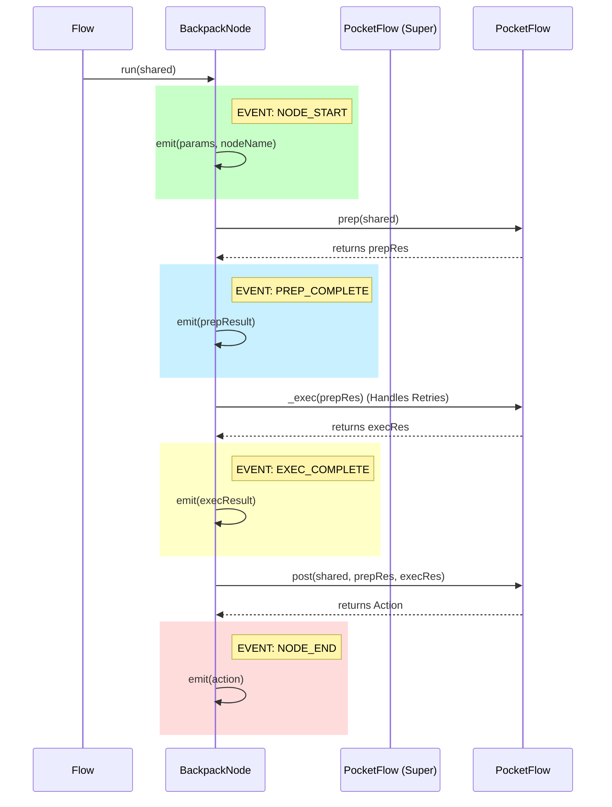

# 📄 PRD: Serialization Bridge & Standardized Telemetry

> **⚠️ DEPRECATED:** This PRD has been split into three focused documents:
> - [PRD-001: Backpack Architecture](./PRD-001-backpack-architecture.md)
> - [PRD-002: Telemetry System](./PRD-002-telemetry-system.md)
> - [PRD-003: Serialization Bridge](./PRD-003-serialization-bridge.md)
> 
> See [ROADMAP.md](../../ROADMAP.md) for the unified v2.0 release plan.

---

**Original Sprint Goal:** Transform `BackpackFlow` from a code-only library into an observable, config-ready engine.

## 1. Problem Statement

Currently, `BackpackFlow` relies on manual instantiation of classes and ad-hoc logging.

1. **No Standard Observability:** There is no standard way for a UI to know what a Node is doing or when it fails.
2. **No Configuration Layer:** Nodes cannot be created from JSON, making the "Low-Code" vision impossible.
3. **Boilerplate:** Developers have to manually implement logging and error handling in every node.

## 2. Technical Architecture

### 2.1 The `BackpackNode` (The Wrapper)

We will introduce a new abstract base class `BackpackNode` that extends the PocketFlow `BaseNode`.
It acts as a "Middleman" that intercepts the execution lifecycle (`prep` -> `exec` -> `post`) to inject events automatically.

**Lifecycle Mapping:**

* **`NODE_START`**: Emitted before `prep()`. Signals entry.
* **`PREP_COMPLETE`**: Emitted after `prep()`. Shows how the node modified the inputs before running.
* **`EXEC_COMPLETE`**: Emitted after `exec()`. Shows the raw result (e.g., raw LLM string).
* **`NODE_END`**: Emitted after `post()`. Shows the final processed output entering the Backpack.
* **`ERROR`**: Emitted if any phase throws an exception.

### 2.2 Standardized Event Schema (The Walkie-Talkie)

All events must strictly adhere to this envelope. This ensures the future UI can render *any* event without custom logic.

```typescript
export enum StreamEventType {
  // Lifecycle (Automatic)
  NODE_START = 'node_start',
  PREP_COMPLETE = 'prep_complete', 
  EXEC_COMPLETE = 'exec_complete',
  NODE_END = 'node_end',
  ERROR = 'error',
  
  // Custom (Manual inside exec)
  STREAM_CHUNK = 'stream_chunk',    // For token streaming
  TOOL_CALL = 'tool_call',          // When an agent calls a tool
  CUSTOM = 'custom'                 // Generic payload
}

export interface BackpackEvent {
  id: string;             // UUID
  timestamp: number;      // Unix Epoch
  sourceNode: string;     // Node Name / ID
  runId: string;          // Correlation ID for the whole flow
  type: StreamEventType;
  payload: Record<string, any>; 
}
```

#### Event Lifecycle Sequence

The key to a good Tracer is **Observability of Transformation**. We intercept PocketFlow's `_run` method to emit events at each phase:



#### Detailed Payload Definitions

Each event type carries specific information that matches PocketFlow's `BaseNode` method signatures:

```typescript
// 1. NODE_START
// Trigger: Start of _run()
// Purpose: "I am starting with these settings."
export interface NodeStartPayload {
  nodeName: string;         // e.g., "ChatNode"
  nodeId: string;           // UUID for this specific instance
  params: Record<string, any>; // content of this._params (The generic P)
}

// 2. PREP_COMPLETE
// Trigger: After await this.prep(shared) returns
// Purpose: "This is the prompt/data I prepared for the LLM."
export interface PrepCompletePayload {
  prepResult: unknown;      // The 'prepRes' from PocketFlow
                            // CRITICAL: This is usually your Prompt string!
}

// 3. EXEC_COMPLETE
// Trigger: After await this._exec(prepRes) returns
// Purpose: "This is the raw answer I got back."
export interface ExecCompletePayload {
  execResult: unknown;      // The 'execRes' from PocketFlow
  attempts: number;         // (Optional) this.currentRetry from Node class
}

// 4. NODE_END
// Trigger: After await this.post() returns
// Purpose: "I am done. I took this path."
export interface NodeEndPayload {
  action: string | undefined; // The 'Action' string (e.g., "default", "retry")
                              // Tells the tracer which line to draw next.
}

// 5. ERROR
// Trigger: Inside catch block of _run
export interface ErrorPayload {
  phase: 'prep' | 'exec' | 'post';
  error: string;            // error.message
  stack?: string;
}
```

#### Why This Structure is Powerful

1. **Debugging `prepRes`:** In 90% of LLM bugs, the issue is "What exactly did I send to the model?" By emitting `PREP_COMPLETE` with the `prepRes`, your Tracer will show the **exact compiled prompt**.

2. **Tracking `execRes`:** `EXEC_COMPLETE` captures the raw string *before* you try to parse it as JSON in the `post` step. If your JSON parsing fails, you can look at this event to see what the LLM actually said (often "I'm sorry, I can't do that...").

3. **Visualizing Flow (`action`):** The `NODE_END` payload carries the `action`. This is what allows your future GUI to highlight the arrow connecting Node A to Node B.

#### Implementation Pattern

Since PocketFlow's `_run` calls the three steps in order, `BackpackNode` overrides it to inject events:

```typescript
// Inside BackpackNode (implementation preview)
async _run(shared: S): Promise<Action | undefined> {
    // 1. START
    this.emit(StreamEventType.NODE_START, { 
        nodeName: this.constructor.name,
        nodeId: this._id,
        params: this._params 
    });

    try {
        // 2. PREP
        const p = await this.prep(shared);
        this.emit(StreamEventType.PREP_COMPLETE, { prepResult: p });

        // 3. EXEC (calls super._exec which handles retries)
        const e = await this._exec(p);
        this.emit(StreamEventType.EXEC_COMPLETE, { 
            execResult: e,
            attempts: (this as any).currentRetry // Accessing Node prop
        });

        // 4. POST
        const action = await this.post(shared, p, e);
        
        // 5. END
        this.emit(StreamEventType.NODE_END, { action });
        
        return action;

    } catch (err) {
        this.emit(StreamEventType.ERROR, { 
            phase: this.determinePhase(err),
            error: err.message,
            stack: err.stack
        });
        throw err;
    }
}
```

### 2.3 Serialization (The Bridge)

Every Node must implement a static factory method. This allows a JSON file to "hydrate" the Node.

```typescript
// The Interface
interface BackpackNodeStatic {
  fromConfig(config: NodeConfig, dependencies: SharedServices): BackpackNode;
}

// The Usage
const node = ChatNode.fromConfig({
  type: 'ChatNode',
  params: {
    model: 'gpt-4',
    temperature: 0.7
  }
}, { llmClient });

```

---

## 3. Implementation Plan (Tasks)

### Task 1: The Event Foundation

* [ ] Define `StreamEventType` enum in `src/events/types.ts`.
* [ ] Define `BackpackEvent` interface with strongly-typed envelope.
* [ ] Define all payload interfaces: `NodeStartPayload`, `PrepCompletePayload`, `ExecCompletePayload`, `NodeEndPayload`, `ErrorPayload`.
* [ ] Refactor `EventStreamer` to strictly enforce `BackpackEvent` (remove `any` types).

### Task 2: The `BackpackNode` Base Class

* [ ] Create `src/nodes/BackpackNode.ts`.
* [ ] Implement the `_run()` override that wraps PocketFlow's lifecycle (`prep` -> `_exec` -> `post`).
* [ ] Emit `NODE_START` with `nodeName`, `nodeId`, and `params`.
* [ ] Emit `PREP_COMPLETE` with `prepResult` after `prep()` completes.
* [ ] Emit `EXEC_COMPLETE` with `execResult` and `attempts` after `_exec()` completes.
* [ ] Emit `NODE_END` with `action` after `post()` completes.
* [ ] Add `emit()` helper method to simplify sending events from inside `exec`.
* [ ] **Crucial:** Ensure it catches errors, emits the `ERROR` event with phase information, and then re-throws (so the Flow stops).

### Task 3: Refactor Existing Nodes

* [ ] Update `ChatNode` to extend `BackpackNode`.
* [ ] Update `AgentNode` to extend `BackpackNode`.
* [ ] Remove manual `console.log` or ad-hoc event emitters from these nodes; rely on the wrapper or standardized `emit()`.

### Task 4: The Config Loader (MVP)

* [ ] Create `fromConfig` static method on `BackpackNode`.
* [ ] Create a simple test script: `test-config-load.ts` that loads a simple flow from a JSON object and runs it.

---

## 4. Decisions & Design Notes

* **Decision: Always Emit All Lifecycle Events**
  * We emit `PREP_COMPLETE` even if `prep()` returns a default/empty value for consistency. This ensures the tracer always shows a complete lifecycle, making it easier to debug when a `prep` method is missing data it should have generated.

* **Decision: Streaming Tokens are Custom Events**
  * The automatic lifecycle events (`NODE_START`, `PREP_COMPLETE`, etc.) happen once per phase. Streaming is a "Custom" event. The `exec` method inside `ChatNode` is responsible for emitting `STREAM_CHUNK` events manually as data comes in from the LLM.

* **Decision: Capture Retry Attempts**
  * Since PocketFlow's `_exec()` handles retries automatically, we expose `attempts` in the `EXEC_COMPLETE` payload by accessing the `currentRetry` property from the Node class. This helps debugging why a node took longer than expected.


---

## 5. Success Criteria

1. **The "No-Code" Test:** I can write a JSON object representing a `ChatNode`, pass it to a factory, and get a working Node instance back.
2. **The "Tracer" Test:** When running a flow, I see a clean log of `NODE_START` -> `PREP` -> `EXEC` -> `END` events with timestamps, without writing any logging code in the Node itself.
3. **The "Debug Prompt" Test:** When an LLM gives an unexpected response, I can inspect the `PREP_COMPLETE` event to see the exact prompt that was sent.
4. **The "Parse Error" Test:** When JSON parsing fails in `post()`, I can inspect the `EXEC_COMPLETE` event to see the raw LLM response before parsing.
5. **The "Flow Visualization" Test:** The `NODE_END` event contains the `action` that tells me which edge/transition the flow took next.

---

**Does this PRD capture the scope correctly?** If yes, we can create the tickets/issues and start coding Task 1.