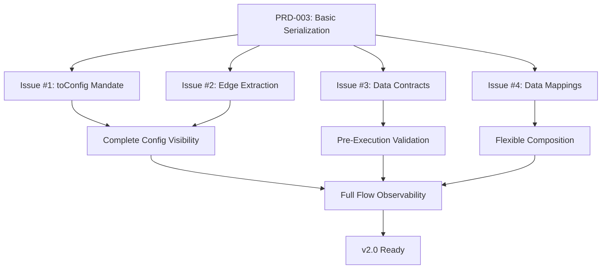

# PRD-005: Complete Flow Observability

**Status:** ✅ **COMPLETE**  
**Priority:** P0 (Core v2.0 Feature - Blocks Release)  
**Target Release:** v2.0.0 (December 21, 2025, Q4)  
**Dependencies:** PRD-001 (Backpack), PRD-002 (Telemetry), PRD-003 (Serialization Bridge), PRD-004 (Composite Nodes)  
**Unblocks:** BackpackFlow Studio UI, v2.0 release 🚀

---

## Executive Summary

During implementation of v2.0, we discovered **critical gaps in flow observability** that prevent us from achieving the core mission: **complete visibility into what's happening in your flows**.

While PRD-003 established the basic serialization framework, real-world usage (building the YouTube Research Agent) revealed that we can't answer fundamental questions:

- ❓ What data does this node need?
- ❓ What data does it produce?
- ❓ Why did this edge routing fail?
- ❓ Can I connect these two nodes?

**This PRD addresses 4 critical issues:**

1. **Enhanced `toConfig()` Requirements** - Mandate param serialization
2. **Edge Extraction** - Complete routing visibility  
3. **Input/Output Contracts** - Data flow visibility & validation
4. **Data Mappings** - Flexible node composition

**Without these, v2.0 cannot ship.** They are required for:
- Pre-execution validation
- UI auto-complete
- Self-documenting nodes
- Error messages that actually help

---

## 1. Problem Statement

### 1.1 The "Black Box Node" Problem

Current state after PRD-003 implementation:

```json
{
  "nodes": [
    {
      "type": "DataAnalysisNode",
      "id": "analysis",
      "params": {}  // ❌ Empty! What's configured?
    }
  ],
  "edges": []  // ❌ Empty! How does data flow?
}
```

**We can't answer:**
- What API key is this node using?
- What temperature setting?
- Which nodes connect to which?
- What data flows between them?

### 1.2 The "Guess and Hope" Problem

Without data contracts:

```typescript
// Developer adds new node to flow
const analysisNode = flow.addNode(DataAnalysisNode, { id: 'analysis' });

// ❓ What data does it need?
// ❓ What keys should I pack in Backpack?
// ❓ Is 'searchResults' the right key or 'data'?

// Only way to find out: Read the source code or crash at runtime
```

###1.3 The "Rigid Coupling" Problem

Nodes must use exact matching keys:

```typescript
// SearchNode outputs
this.pack('searchResults', data);

// AnalysisNode expects
const data = this.unpackRequired('dataToAnalyze');  // ❌ Key mismatch!

// Can't connect them without writing a wrapper node
```

**This prevents:**
- Reusing generic nodes
- Building visual flow builders
- Composing nodes from different libraries

---

## 2. Solution Overview

### Four Enhancements to Complete Observability



---

## 3. Issue #1: Enhanced toConfig() Requirements

### 3.1 Problem

Nodes without `toConfig()` implementation fall back to empty `params: {}`, losing all configuration data.

```typescript
// Node without toConfig()
class YouTubeSearchNode extends BackpackNode {
    constructor(config: { apiKey: string, maxResults: number }) { ... }
    // ❌ No toConfig() method
}

// Serialized output (loses data):
{
    "type": "YouTubeSearchNode",
    "id": "search",
    "params": {}  // ❌ Empty! Lost apiKey and maxResults
}
```

### 3.2 Solution

**Mandate `toConfig()` implementation with proper warnings.**

```typescript
class YouTubeSearchNode extends BackpackNode {
    toConfig(): NodeConfig {
        return {
            type: 'YouTubeSearchNode',
            id: this.id,
            params: {
                apiKey: '***',  // ✅ Mask sensitive data
                maxResults: this.maxResults
            }
        };
    }
}
```

### 3.3 Implementation Requirements

**1. Update `FlowLoader.exportNode()`:**

```typescript
private exportNode(node: BackpackNode): NodeConfig {
    // Prefer node's toConfig()
    if ('toConfig' in node && typeof (node as any).toConfig === 'function') {
        return (node as any).toConfig();
    }
    
    // Fallback with warning
    console.warn(
        `Node '${node.id}' of type '${node.constructor.name}' ` +
        `does not implement toConfig(). Using fallback serialization. ` +
        `This may lose configuration data.`
    );
    
    return {
        type: node.constructor.name,
        id: node.id,
        params: {}
    };
}
```

**2. Security: Always Mask Sensitive Data**

```typescript
toConfig(): NodeConfig {
    return {
        type: 'MyNode',
        id: this.id,
        params: {
            apiKey: '***',            // ✅ Never expose API keys
            password: '***',          // ✅ Never expose passwords  
            model: this.model,        // ✅ Safe to expose
            temperature: this.temperature
        }
    };
}
```

**3. Documentation:**
- All tutorial nodes MUST implement `toConfig()`
- Add to BackpackNode docs as "strongly recommended"
- Include security guidelines for sensitive data

### 3.4 Testing Requirements

```typescript
describe('toConfig() Implementation', () => {
    it('should serialize all configuration params', () => {
        const node = new YouTubeSearchNode({
            id: 'search',
            apiKey: 'secret123',
            maxResults: 50
        }, context);
        
        const config = node.toConfig();
        
        expect(config.params.apiKey).toBe('***');  // Masked
        expect(config.params.maxResults).toBe(50);  // Preserved
    });
    
    it('should warn if toConfig() not implemented', () => {
        const warnSpy = jest.spyOn(console, 'warn');
        const node = new NodeWithoutToConfig({ id: 'test' }, context);
        
        loader.exportNode(node);
        
        expect(warnSpy).toHaveBeenCalledWith(
            expect.stringContaining('does not implement toConfig()')
        );
    });
});
```

---

## 4. Issue #2: Edge Extraction

### 4.1 Problem

`FlowLoader.exportFlow()` always returns empty `edges: []`, losing all flow routing logic.

```json
{
  "nodes": [...],
  "edges": []  // ❌ Always empty!
}
```

### 4.2 Solution

**Extract edges from PocketFlow's internal `_successors` map.**

```typescript
/**
 * Export flow to configuration (ENHANCED)
 */
exportFlow(flow: Flow): FlowConfig {
    const nodes: NodeConfig[] = [];
    const edges: FlowEdge[] = [];
    
    // Extract nodes
    for (const node of flow.getAllNodes()) {
        nodes.push(this.exportNode(node));
    }
    
    // Extract edges from PocketFlow's internal _successors map
    for (const node of flow.getAllNodes()) {
        const successors = (node as any)._successors as Map<string, BackpackNode>;
        
        if (successors) {
            for (const [action, targetNode] of successors.entries()) {
                edges.push({
                    from: node.id,
                    to: targetNode.id,
                    condition: action
                });
            }
        }
    }
    
    return {
        version: '2.0.0',
        namespace: flow.namespace,
        nodes,
        edges,  // ✅ Now populated!
        dependencies: {}
    };
}
```

### 4.3 Testing Requirements

```typescript
describe('Edge Extraction', () => {
    it('should extract edges from flow', () => {
        const flow = new Flow({ namespace: 'test' });
        const node1 = flow.addNode(TestNode, { id: 'node1' });
        const node2 = flow.addNode(TestNode, { id: 'node2' });
        const node3 = flow.addNode(TestNode, { id: 'node3' });
        
        node1.onComplete(node2);
        node1.on('error', node3);
        
        const config = loader.exportFlow(flow);
        
        expect(config.edges).toHaveLength(2);
        expect(config.edges).toContainEqual({
            from: 'node1',
            to: 'node2',
            condition: 'complete'
        });
        expect(config.edges).toContainEqual({
            from: 'node1',
            to: 'node3',
            condition: 'error'
        });
    });
    
    it('should handle nodes with no edges', () => {
        const flow = new Flow({ namespace: 'test' });
        flow.addNode(TestNode, { id: 'isolated' });
        
        const config = loader.exportFlow(flow);
        
        expect(config.edges).toHaveLength(0);
    });
});
```

---

## 5. Issue #3: Input/Output Contracts (Data Contracts)

### 5.1 Problem

**No way to know what data a node reads from or writes to Backpack.**

This breaks:
- ❌ Pre-execution validation
- ❌ UI auto-complete
- ❌ Self-documentation
- ❌ Meaningful error messages

```json
// Current (no visibility into data flow):
{
    "type": "DataAnalysisNode",
    "params": { "metric": "views" }
    // ❌ What data does it need?
    // ❌ What data does it produce?
}
```

### 5.2 Solution: Optional Data Contracts

**Add optional `inputs` and `outputs` contracts to nodes.**

**Architectural Decision: Pure Zod Schemas**

We use **Zod exclusively** for data contracts - no dual-system, no backward compatibility burden. This provides:
- ✅ **Type inference**: No duplicate type definitions
- ✅ **Runtime validation**: Automatic, detailed error messages  
- ✅ **Composability**: Reuse schemas across nodes
- ✅ **Industry standard**: Developers already know it
- ✅ **JSON Schema export**: Generate OpenAPI docs, UI forms
- ✅ **Single source of truth**: Schema = Type = Validation

```typescript
import { z } from 'zod';

/**
 * Data contract (inputs or outputs)
 * 
 * A record of Zod schemas defining the shape and validation rules
 * for data flowing through the Backpack.
 */
export type DataContract = Record<string, z.ZodType<any>>;

/**
 * Node with optional data contracts
 */
abstract class BackpackNode extends BaseNode {
    static inputs?: DataContract;
    static outputs?: DataContract;
}
```

### 5.3 Usage Example

**YouTube Search Node with Zod Contracts:**

```typescript
import { z } from 'zod';
import { BackpackNode } from '../nodes/backpack-node';

// Define reusable schemas
const YouTubeVideoSchema = z.object({
    id: z.string(),
    title: z.string(),
    channelTitle: z.string(),
    channelId: z.string(),
    views: z.number(),
    likes: z.number(),
    comments: z.number(),
    publishedAt: z.date(),
    duration: z.string(),
    thumbnail: z.string().url(),
    url: z.string().url(),
    description: z.string()
});

// Infer TypeScript types from Zod (single source of truth!)
export type YouTubeVideo = z.infer<typeof YouTubeVideoSchema>;

export class YouTubeSearchNode extends BackpackNode {
    // Define what data this node needs
    static inputs: DataContract = {
        searchQuery: z.string().describe('YouTube search query (e.g., "AI productivity tools")'),
        maxResults: z.number().optional().default(50).describe('Maximum results to return')
    };
    
    // Define what data this node produces
    static outputs: DataContract = {
        searchResults: z.array(YouTubeVideoSchema)
            .describe('Array of YouTube videos with full metadata (title, views, channel, etc.)')
    };
    
    async prep(shared: any): Promise<any> {
        // Validation happens automatically before prep!
        // If searchQuery is missing or not a string, node fails BEFORE this runs
        const query = this.unpackRequired<string>('searchQuery');
        const maxResults = this.unpack<number>('maxResults') ?? 50;
        return { query, maxResults };
    }
    
    async _exec(prepRes: any): Promise<any> {
        // Call YouTube API
        const videos = await this.searchYouTube(prepRes.query, prepRes.maxResults);
        return videos;
    }
    
    async post(shared: any, prep: any, exec: any): Promise<string> {
        // Pack output (automatically validated against output schema!)
        this.pack('searchResults', exec);
        return 'complete';
    }
}
```

**Data Analysis Node:**

```typescript
export class DataAnalysisNode extends BackpackNode {
    static inputs: DataContract = {
        searchResults: z.array(YouTubeVideoSchema) // Reuse schema!
            .describe('YouTube videos to analyze for breakthrough content')
    };
    
    static outputs: DataContract = {
        outliers: z.array(YouTubeVideoSchema)
            .describe('Videos identified as breakthrough content'),
        statistics: z.object({
            mean: z.number(),
            median: z.number(),
            stdDev: z.number(),
            min: z.number(),
            max: z.number()
        }).describe('Statistical summary of video performance'),
        prompt: z.string()
            .describe('Generated prompt for LLM to summarize findings')
    };
    
    async _exec(prepRes: any): Promise<any> {
        const videos = this.unpackRequired<YouTubeVideo[]>('searchResults');
        
        // Analyze for outliers
        const outliers = this.findChannelRelativeOutliers(videos);
        const stats = this.calculateStats(videos);
        const prompt = this.generatePrompt(outliers, stats);
        
        return { outliers, statistics: stats, prompt };
    }
    
    async post(shared: any, prep: any, exec: any): Promise<string> {
        // All outputs validated against schemas!
        this.pack('outliers', exec.outliers);
        this.pack('statistics', exec.statistics);
        this.pack('prompt', exec.prompt);
        return 'complete';
    }
}
```

### 5.4 Serialization (JSON Schema Export)

Zod schemas can be converted to JSON Schema for serialization, documentation, and UI generation:

```typescript
import { zodToJsonSchema } from 'zod-to-json-schema';

// Export node config with JSON Schema
const config = {
    type: "YouTubeSearchNode",
    id: "search",
    params: {
        apiKey: "***masked***",
        maxResults: 50
    },
    inputs: zodToJsonSchema(z.object({
        searchQuery: YouTubeSearchNode.inputs.searchQuery
    })),
    outputs: zodToJsonSchema(z.object({
        searchResults: YouTubeSearchNode.outputs.searchResults
    }))
};
```

**Resulting JSON Schema:**

```json
{
    "type": "YouTubeSearchNode",
    "id": "search",
    "params": {
        "apiKey": "***masked***",
        "maxResults": 50
    },
    "inputs": {
        "type": "object",
        "properties": {
            "searchQuery": {
                "type": "string",
                "description": "YouTube search query (e.g., \"AI productivity tools\")"
            }
        },
        "required": ["searchQuery"]
    },
    "outputs": {
        "type": "object",
        "properties": {
            "searchResults": {
                "type": "array",
                "items": {
                    "type": "object",
                    "properties": {
                        "id": { "type": "string" },
                        "title": { "type": "string" },
                        "channelTitle": { "type": "string" },
                        "views": { "type": "number" },
                        "likes": { "type": "number" },
                        "thumbnail": { "type": "string", "format": "uri" },
                        "url": { "type": "string", "format": "uri" }
                    },
                    "required": ["id", "title", "channelTitle", "views", "likes", "thumbnail", "url"]
                },
                "description": "Array of YouTube videos with full metadata"
            }
        },
        "required": ["searchResults"]
    }
}
```

**Benefits:**
- ✅ **Complete type information**: Nested objects, arrays, all properties
- ✅ **UI auto-generation**: Forms can be built from schema
- ✅ **Documentation**: OpenAPI/Swagger compatible
- ✅ **Validation**: Can validate at load-time and runtime

### 5.5 Runtime Validation (Pure Zod)

**Simplified validation using Zod's built-in capabilities:**

```typescript
import { z } from 'zod';

/**
 * Validate inputs before node execution
 * 
 * Uses Zod's safeParse for comprehensive validation:
 * - Type checking (string, number, boolean, array, object)
 * - Required vs optional fields
 * - Nested object validation
 * - Array element validation
 * - Custom constraints (min, max, regex, etc.)
 */
protected validateInputs(contracts: DataContract): void {
    const violations: Array<{ key: string; errors: string[] }> = [];
    
    for (const [key, schema] of Object.entries(contracts)) {
        const value = this.backpack.unpack(key, this.id);
        
        // Validate with Zod
        const result = schema.safeParse(value);
        
        if (!result.success) {
            // Collect all validation errors with paths
            const errors = result.error.issues.map(issue => {
                const path = issue.path.length > 0 
                    ? `${issue.path.join('.')}: ` 
                    : '';
                return `${path}${issue.message}`;
            });
            violations.push({ key, errors });
        }
    }
    
    if (violations.length > 0) {
        // Format detailed error message
        const details = violations
            .map(v => `  - ${v.key}:\n${v.errors.map(e => `      ${e}`).join('\n')}`)
            .join('\n');
        
        throw new ContractValidationError(
            `Node '${this.id}' (${this.constructor.name}) input validation failed:\n${details}`,
            this.id,
            violations
        );
    }
}

/**
 * Modified _run with validation
 */
async _run(shared: S): Promise<string | undefined> {
    const startTime = Date.now();
    
    try {
        // Emit NODE_START event
        this.emitNodeStart(shared);
        
        // PRD-005: Validate input contracts (if defined)
        const constructor = this.constructor as typeof BackpackNode;
        if (constructor.inputs) {
            this.validateInputs(constructor.inputs); // ✅ Zod validation
        }
        
        // Run prep phase
        const prepResult = await this.prep(shared);
        
        // Run exec phase
        const execResult = await this._exec(prepResult);
        
        // Run post phase
        const action = await this.post(shared, prepResult, execResult);
        
        // Emit NODE_END event
        this.emitNodeEnd(action);
        
        return action;
    } catch (error) {
        // Handle validation errors gracefully
        this.emitError(error as Error, 'validation');
        throw error;
    }
}
```

**Example Validation Errors:**

```typescript
// Missing required field:
ContractValidationError: Node 'search' (YouTubeSearchNode) input validation failed:
  - searchQuery:
      Required

// Wrong type:
ContractValidationError: Node 'search' (YouTubeSearchNode) input validation failed:
  - searchQuery:
      Expected string, received number

// Nested object validation:
ContractValidationError: Node 'analysis' (DataAnalysisNode) input validation failed:
  - searchResults:
      0.views: Expected number, received string
      2.channelId: Required
```

**Benefits of Zod Validation:**
- ✅ **Automatic type checking**: No manual `typeof` checks needed
- ✅ **Deep validation**: Nested objects, arrays, all properties validated
- ✅ **Detailed errors**: Exact path to invalid field
- ✅ **Optional fields**: Handled automatically with `.optional()`
- ✅ **Default values**: Applied automatically with `.default()`
- ✅ **Custom validation**: Easy to add with `.refine()` or `.superRefine()`
- ✅ **Type inference**: TypeScript types derived from schemas

### 5.6 Benefits

**1. Pre-Execution Validation:**

```typescript
// Fails fast with clear error BEFORE execution
throw new ValidationError(
    "Node 'analysis' missing required input: 'searchResults'. " +
    "Expected type: array. " +
    "Description: Array of items to analyze"
);
```

**2. UI Auto-Complete:**

```typescript
// UI can suggest compatible nodes
const searchNodeOutputs = ['searchResults', 'searchMetadata'];
const analysisNodeInputs = ['searchResults'];  // ✅ Compatible!

// Show green checkmark in UI: search.searchResults → analysis.searchResults
```

**3. Self-Documenting:**

```typescript
// Developers can see node contracts without reading implementation
console.log(DataAnalysisNode.inputs);
// { searchResults: { type: 'array', required: true, description: '...' } }
```

**4. Static Analysis:**

```typescript
// Can validate flow compatibility without running
const flow = loader.loadFlow(config);
const issues = flow.validateDataFlow();
// [
//   {
//     issue: "Node 'analysis' expects 'searchResults' (array) " +
//            "but previous node 'search' produces 'results' (array)"
//   }
// ]
```

### 5.7 Design Decisions

**1. Optional, Not Mandatory:**
- ✅ Backward compatible
- ✅ Simple nodes can skip contracts
- ✅ Library nodes should include contracts
- ✅ Progressive enhancement

**2. Static Properties:**
- ✅ Defined on class, not instance
- ✅ Can be inspected without instantiation
- ✅ Easy for tooling to discover
- ✅ No runtime overhead when not used

**3. Progressive Enhancement:**
- ✅ Basic type checking by default
- ✅ Deep Zod validation opt-in
- ✅ Validation only runs if contract exists

### 5.8 Testing Requirements

```typescript
describe('Data Contracts', () => {
    it('should validate required inputs', async () => {
        const node = new DataAnalysisNode({ id: 'analysis' }, context);
        
        // Don't pack required input
        // node.backpack.pack('searchResults', data);
        
        await expect(node._run({})).rejects.toThrow(
            "Node 'analysis' missing required input: 'searchResults'"
        );
    });
    
    it('should validate input types', async () => {
        const node = new DataAnalysisNode({ id: 'analysis' }, context);
        
        // Pack wrong type
        node.backpack.pack('searchResults', 'not an array');
        
        await expect(node._run({})).rejects.toThrow(
            "input 'searchResults' has wrong type. Expected array, got string"
        );
    });
    
    it('should serialize contracts', () => {
        const config = DataAnalysisNode.toConfig();
        
        expect(config.inputs).toHaveProperty('searchResults');
        expect(config.inputs.searchResults.type).toBe('array');
        expect(config.inputs.searchResults.required).toBe(true);
        
        expect(config.outputs).toHaveProperty('outliers');
        expect(config.outputs.outliers.type).toBe('array');
    });
    
    it('should skip validation if no contract defined', async () => {
        const node = new NodeWithoutContract({ id: 'test' }, context);
        
        // Should not throw even with missing data
        await expect(node._run({})).resolves.not.toThrow();
    });
});
```

---

## 6. Issue #4: Data Mappings (Edge-Level Key Remapping)

### 6.1 Problem

**Nodes must use exact matching Backpack keys.**

This prevents:
- ❌ Reusing generic nodes with different naming conventions
- ❌ Visual flow builders where users connect arbitrary nodes
- ❌ Composing nodes from different libraries

```typescript
// SearchNode outputs:
this.pack('searchResults', data);

// AnalysisNode expects:
const data = this.unpackRequired('dataToAnalyze');  // ❌ Key mismatch!

// Can't connect them without writing a wrapper node
```

### 6.2 Solution: Edge-Level Key Mappings

**Add optional key mappings at the edge level.**

```typescript
/**
 * Extended edge configuration with optional mappings
 */
interface FlowEdge {
    from: string;
    to: string;
    condition: string;
    mappings?: {
        [sourceKey: string]: string;  // sourceKey -> targetKey
    };
}
```

### 6.3 Usage in Code

```typescript
// Style 1: Extended .on() method (recommended)
searchNode.on('complete', analysisNode, {
    mappings: {
        'searchResults': 'dataToAnalyze',  // Remap key
        'metadata': 'context'
    }
});

// Style 2: Without mappings (keys must match)
searchNode.onComplete(analysisNode);  // Assumes keys match
```

### 6.4 Serialization

```json
{
    "edges": [
        {
            "from": "search",
            "to": "analysis",
            "condition": "complete",
            "mappings": {
                "searchResults": "dataToAnalyze",
                "metadata": "context"
            }
        }
    ]
}
```

### 6.5 Runtime Behavior

```typescript
/**
 * Flow execution with edge mappings
 */
async runNode(node: BackpackNode): Promise<string | undefined> {
    const action = await node._run(this.backpack);
    
    if (action) {
        const edge = this.findEdge(node.id, action);
        
        if (edge && edge.mappings) {
            // Apply mappings before next node executes
            this.applyMappings(edge.mappings);
        }
        
        const nextNode = node.getNextNode(action);
        if (nextNode) {
            return await this.runNode(nextNode);
        }
    }
    
    return action;
}

/**
 * Apply edge mappings
 */
private applyMappings(mappings: Record<string, string>): void {
    for (const [sourceKey, targetKey] of Object.entries(mappings)) {
        const value = this.backpack.unpack(sourceKey);
        
        if (value !== undefined) {
            this.backpack.pack(targetKey, value);
        }
    }
}

/**
 * Find edge for current node and action
 */
private findEdge(nodeId: string, action: string): FlowEdge | undefined {
    return this.edges.find(e => e.from === nodeId && e.condition === action);
}
```

### 6.6 Example Use Case

```typescript
// Generic reusable node
class DataProcessorNode extends BackpackNode {
    static inputs = {
        data: { type: 'array', required: true }  // Generic "data" key
    };
    
    async prep() {
        return { data: this.unpackRequired('data') };
    }
}

// Use with different sources
const searchNode = flow.addNode(SearchNode, { id: 'search' });
const processor = flow.addNode(DataProcessorNode, { id: 'processor' });

// Map 'searchResults' → 'data'
searchNode.on('complete', processor, {
    mappings: { 'searchResults': 'data' }
});

// Now processor can work with search output!
```

### 6.7 Benefits

**1. Node Reusability:**
- Generic nodes work with any source
- No need to create custom wrappers
- Library of reusable components

**2. Visual Flow Builders:**
- Users can connect any nodes
- UI generates mappings automatically
- Drag-and-drop compatibility

**3. Library Composition:**
- Mix nodes from different libraries
- No coordination on key names needed
- Adapter-free integration

**4. Clean Separation:**
- Nodes define their interface (inputs/outputs)
- Flows handle integration (mappings)
- Single Responsibility Principle

### 6.8 Design Decisions

**1. Edge-Level, Not Node-Level:**
- ✅ More flexible (same node, different mappings)
- ✅ Clearer (mapping at connection point)
- ✅ Better for UI (transformation "on the wire")

**2. Optional:**
- ✅ Most flows won't need mappings
- ✅ Keys can match by design
- ✅ Progressive enhancement

**3. Simple Key Remapping Only (v2.0):**
- ✅ Just `sourceKey` → `targetKey`
- ❌ No transformations (e.g., filtering, mapping arrays)
- 📅 Transformations can come in v2.1+

### 6.9 Implementation Requirements

**1. Extend FlowEdge Interface:**

```typescript
// src/storage/types.ts
export interface FlowEdge {
    from: string;
    to: string;
    condition: string;
    mappings?: Record<string, string>;  // ✅ New
}
```

**2. Update PocketFlow's `.on()` Method:**

```typescript
// src/pocketflow.ts
on(action: Action, node: BaseNode, options?: EdgeOptions): this {
    if (this._successors.has(action)) {
        console.warn(`Overwriting successor for action '${action}'`);
    }
    
    this._successors.set(action, node);
    
    // Store mapping metadata (if provided)
    if (options?.mappings) {
        this._edgeMappings = this._edgeMappings || new Map();
        this._edgeMappings.set(action, options.mappings);
    }
    
    return this;
}

interface EdgeOptions {
    mappings?: Record<string, string>;
}
```

**3. Update Edge Extraction:**

```typescript
// src/serialization/flow-loader.ts
for (const node of flow.getAllNodes()) {
    const successors = (node as any)._successors as Map<string, BackpackNode>;
    const mappings = (node as any)._edgeMappings as Map<string, Record<string, string>>;
    
    if (successors) {
        for (const [action, targetNode] of successors.entries()) {
            const edge: FlowEdge = {
                from: node.id,
                to: targetNode.id,
                condition: action
            };
            
            // Add mappings if present
            if (mappings && mappings.has(action)) {
                edge.mappings = mappings.get(action);
            }
            
            edges.push(edge);
        }
    }
}
```

**4. Implement Mapping Application in Flow:**

```typescript
// src/flows/flow.ts
private async executeEdge(edge: FlowEdge): Promise<void> {
    if (edge.mappings) {
        for (const [sourceKey, targetKey] of Object.entries(edge.mappings)) {
            const value = this.backpack.unpack(sourceKey);
            
            if (value !== undefined) {
                this.backpack.pack(targetKey, value);
            } else if (process.env.NODE_ENV === 'development') {
                console.warn(
                    `Mapping warning: Source key '${sourceKey}' not found in Backpack ` +
                    `for edge ${edge.from} → ${edge.to}`
                );
            }
        }
    }
}
```

### 6.10 Testing Requirements

```typescript
describe('Data Mappings', () => {
    it('should map keys during edge execution', async () => {
        const flow = new Flow({ namespace: 'test' });
        const node1 = flow.addNode(ProducerNode, { id: 'producer' });
        const node2 = flow.addNode(ConsumerNode, { id: 'consumer' });
        
        node1.on('complete', node2, {
            mappings: { 'output': 'input' }
        });
        
        flow.backpack.pack('trigger', true);
        await flow.run({});
        
        // Consumer should receive mapped data
        expect(flow.backpack.unpack('processedInput')).toBe('success');
    });
    
    it('should serialize mappings in edges', () => {
        const flow = new Flow({ namespace: 'test' });
        const node1 = flow.addNode(TestNode, { id: 'node1' });
        const node2 = flow.addNode(TestNode, { id: 'node2' });
        
        node1.on('complete', node2, {
            mappings: { 'key1': 'key2' }
        });
        
        const config = loader.exportFlow(flow);
        
        expect(config.edges[0].mappings).toEqual({ 'key1': 'key2' });
    });
    
    it('should warn if mapped source key not found', async () => {
        const warnSpy = jest.spyOn(console, 'warn');
        const flow = new Flow({ namespace: 'test' });
        
        const node1 = flow.addNode(TestNode, { id: 'node1' });
        const node2 = flow.addNode(TestNode, { id: 'node2' });
        
        node1.on('complete', node2, {
            mappings: { 'nonexistent': 'target' }
        });
        
        await flow.run({});
        
        expect(warnSpy).toHaveBeenCalledWith(
            expect.stringContaining("Source key 'nonexistent' not found")
        );
    });
});
```

### 6.11 Future Enhancements (v2.1+)

**Transform data during mapping:**

```typescript
// With function transformers
searchNode.on('complete', analysisNode, {
    mappings: {
        'searchResults': {
            to: 'dataToAnalyze',
            transform: (data: any[]) => data.filter(x => x.views > 1000)
        }
    }
});

// Or with JSON Logic for config-driven transforms
{
    "mappings": {
        "searchResults": {
            "to": "dataToAnalyze",
            "transform": {
                "filter": { ">": [{ "var": "views" }, 1000] }
            }
        }
    }
}
```

---

## 7. Implementation Status & Next Steps

### 7.1 Status Summary

| Issue | Status | Code | Tests | Docs | Blocks |
|-------|--------|------|-------|------|--------|
| **#1: toConfig Mandate** | ⚠️ Partial | ✅ Done | ❌ Todo | ❌ Todo | Complete serialization |
| **#2: Edge Extraction** | ⚠️ Partial | ✅ Done | ❌ Todo | ❌ Todo | Flow routing visibility |
| **#3: Data Contracts** | ❌ Not Started | ❌ Todo | ❌ Todo | ❌ Todo | Pre-execution validation, UI |
| **#4: Data Mappings** | ❌ Not Started | ❌ Todo | ❌ Todo | ❌ Todo | Node reusability, UI |

### 7.2 What's Been Done (Partial Fixes)

**Issues #1 & #2 - Code Changes:**
- ✅ Added `toConfig()` to tutorial nodes
- ✅ Updated `FlowLoader.exportFlow()` to extract edges
- ⚠️ Not tested
- ⚠️ Not documented

### 7.3 What's Still Needed

**Week 1: Issues #3 & #4 (Data Contracts + Mappings)**

**Day 1-2: Data Contracts**
- [ ] Add `DataContract` types to `src/storage/types.ts`
- [ ] Update `BackpackNode` with validation logic
- [ ] Add `validateInputs()` method
- [ ] Update `_run()` to call validation
- [ ] Write comprehensive tests
- [ ] Update tutorial nodes with contracts

**Day 3-4: Data Mappings**
- [ ] Extend `FlowEdge` interface with `mappings`
- [ ] Update PocketFlow's `.on()` method signature
- [ ] Implement `applyMappings()` in Flow
- [ ] Update edge extraction to include mappings
- [ ] Write tests for mapping behavior
- [ ] Add examples to tutorials

**Day 5: Integration**
- [ ] E2E test: Flow with contracts and mappings
- [ ] Performance test: Large flows (100+ nodes)

**Week 2: Complete Issues #1 & #2 + Documentation**

**Day 1-2: Finish #1 & #2**
- [ ] Add warning logs for nodes without `toConfig()`
- [ ] Write tests for param serialization
- [ ] Write tests for edge extraction
- [ ] Handle edge cases (no edges, circular refs)

**Day 3-4: Documentation**
- [ ] Update node development guide
- [ ] Add serialization examples
- [ ] Create tutorial on building serializable nodes
- [ ] Update migration guide (v1 → v2)
- [ ] Document contract system
- [ ] Document mapping system

**Day 5: Final Review**
- [ ] Code review
- [ ] Documentation review
- [ ] Ready for v2.0 release

### 7.4 Success Criteria

**For v2.0 Release:**
- ✅ All 4 issues implemented and tested
- ✅ Round-trip guarantee: `exportFlow(loadFlow(config))` === `config`
- ✅ Complete data flow visibility (inputs, outputs, mappings)
- ✅ Runtime validation with clear error messages
- ✅ All tutorial nodes demonstrate best practices
- ✅ Documentation complete with examples

**Key Metrics:**
- Zero empty `params: {}` in tutorial serializations
- Zero empty `edges: []` in tutorial serializations
- 100% of tutorial nodes have input/output contracts
- All flows pass pre-execution validation

---

## 8. Open Questions

### Q1: Should contracts be mandatory for library nodes?

**Decision:** ✅ A - Optional (recommended but not enforced)

**Reasoning:**
- Backward compatible
- Allows gradual adoption
- Library maintainers can enforce via linting
- Can move to tiered approach in v2.1+ if needed

---

### Q2: Should mapping validation happen at load time or runtime?

**Decision:** ✅ C - Both (Basic check at load, deep check at runtime)

**Reasoning:**
- Fail fast when possible (load time catches structure errors)
- Handle runtime issues gracefully (data availability)
- Best developer experience

**Implementation:**
```typescript
// Load time: Check structure
if (edge.mappings) {
    if (typeof edge.mappings !== 'object') {
        throw new ValidationError(`Invalid mappings for edge ${edge.from} → ${edge.to}`);
    }
}

// Runtime: Check data availability
if (!this.backpack.has(sourceKey)) {
    console.warn(`Mapping source key '${sourceKey}' not found`);
}
```

---

### Q3: How to handle mapping conflicts?

**Scenario:** Two edges write to the same target key.

```typescript
node1.on('complete', node3, { mappings: { 'data': 'result' } });
node2.on('complete', node3, { mappings: { 'output': 'result' } });  // Conflict!
```

**Decision:** ✅ B - Throw error (explicit is better)

**Reasoning:**
- Safe and explicit
- Prevents silent data races
- Developer can fix by using different keys or adding override flag
- Can add `allowConflicts` option in v2.1+ if needed

**Implementation:**
```typescript
// Detect conflict at load time
const mappedTargets = new Set<string>();

for (const edge of config.edges) {
    if (edge.mappings) {
        for (const targetKey of Object.values(edge.mappings)) {
            if (mappedTargets.has(targetKey)) {
                throw new ValidationError(
                    `Mapping conflict: Multiple edges map to '${targetKey}'. ` +
                    `This can cause data races.`
                );
            }
            mappedTargets.add(targetKey);
        }
    }
}
```

---

## 9. Related Documents

- **PRD-001:** Backpack Architecture
- **PRD-002:** Telemetry System
- **PRD-003:** Serialization Bridge (Basic framework)
- **PRD-004:** Composite Nodes & Nested Flows
- **TECH-SPEC-005:** Complete Flow Observability Implementation (to be created)

---

## 10. Appendix: Complete Type Definitions

```typescript
/**
 * Data contract field definition
 */
/**
 * Data contract (inputs or outputs)
 * 
 * Pure Zod schemas for runtime validation and type inference
 */
export type DataContract = Record<string, z.ZodType<any>>;

/**
 * Node configuration with contracts
 * 
 * NOTE: inputs/outputs are Zod schemas at runtime, but can be serialized
 * to JSON Schema for storage/transmission using zodToJsonSchema()
 */
export interface NodeConfig {
    type: string;
    id: string;
    params: Record<string, any>;
    inputs?: Record<string, any>;   // ✅ JSON Schema (serialized Zod)
    outputs?: Record<string, any>;  // ✅ JSON Schema (serialized Zod)
    internalFlow?: FlowConfig;
}

/**
 * Flow edge with mappings
 */
export interface FlowEdge {
    from: string;
    to: string;
    condition: string;
    mappings?: Record<string, string>;  // ✅ New
}

/**
 * Edge options for .on() method
 */
export interface EdgeOptions {
    mappings?: Record<string, string>;
}

/**
 * Extended BaseNode
 */
abstract class BaseNode {
    on(action: string, node: BaseNode, options?: EdgeOptions): this;
    onComplete(node: BaseNode, options?: EdgeOptions): this;
    onError(node: BaseNode, options?: EdgeOptions): this;
}

/**
 * BackpackNode with contracts
 */
abstract class BackpackNode extends BaseNode {
    static inputs?: DataContract;
    static outputs?: DataContract;
    
    protected validateInputs(contracts: DataContract): void;
    private isValidType(value: any, expectedType: string): boolean;
}
```

---

## Implementation Status

### ✅ Issue #1: Enhanced `toConfig()` Requirements (Complete)

**What was implemented:**
1. **FlowLoader Warning System**
   - Added `exportNode()` private method in `FlowLoader` that checks for `toConfig()` implementation
   - Logs a developer-friendly warning when a node lacks `toConfig()`:
     ```
     Node 'node-id' of type 'NodeClassName' does not implement toConfig(). 
     Using fallback serialization. Please implement toConfig() for full observability. 
     See PRD-005 Issue #1.
     ```
   - Uses fallback serialization: `{ type: nodeClassName, id: nodeId, params: {} }`

2. **fromConfig() Integration**
   - Modified `FlowLoader.loadFlow()` to prefer `fromConfig()` static method when available
   - Properly handles `NodeConfig` structure with nested `params` property
   - Falls back to direct constructor call for nodes without `fromConfig()`
   - Added `Flow.registerNode()` helper method for manual node registration

3. **Comprehensive Test Coverage**
   - ✅ Test: Nodes with `toConfig()` serialize correctly with all params
   - ✅ Test: Nodes without `toConfig()` trigger warning and use fallback
   - ✅ Test: No warning when node implements `toConfig()`

**Files Modified:**
- `src/serialization/flow-loader.ts` (lines 105-155, 231-238, 331-336)
- `src/flows/flow.ts` (added `registerNode()` method)
- `tests/serialization/serialization.test.ts` (added Issue #1 test suite)

---

### ✅ Issue #2: Edge Extraction (Complete)

**What was implemented:**
1. **Edge Extraction Logic**
   - `FlowLoader.exportFlow()` now accesses PocketFlow's `_successors` map (private property)
   - Iterates through all nodes and their successors to build edge list
   - Correctly maps edge conditions to `FlowEdge` format: `{ from, to, condition }`

2. **Edge Structure**
   - Edges exported as: `{ from: 'node-id', to: 'target-id', condition: 'action-string' }`
   - Supports multiple edges from the same node (e.g., `onComplete`, `onError`)
   - Handles flows with no edges (empty array)

3. **Comprehensive Test Coverage**
   - ✅ Test: Extract single edge from simple flow
   - ✅ Test: Extract multiple edges from same node
   - ✅ Test: Handle flows with no edges
   - ✅ Test: Round-trip edges correctly (export → load → export)

**Files Modified:**
- `src/serialization/flow-loader.ts` (lines 261-281 in `exportFlow()`)
- `tests/serialization/serialization.test.ts` (added Issue #2 test suite)

---

### ✅ Issue #3: Input/Output Contracts (Complete)

**What was implemented:**
1. **Type Definitions**
   - Added `DataContract` and `DataContractField` interfaces to serialization types
   - `DataContractField` supports: `type`, `required`, and `description` properties
   - Supported types: `string`, `number`, `boolean`, `object`, `array`, `any`
   - Added `ContractValidationError` error class for validation failures

2. **Static Properties on BackpackNode**
   - Added optional `static inputs?: DataContract` property
   - Added optional `static outputs?: DataContract` property
   - Contracts are defined at the class level, accessible via `constructor.inputs/outputs`

3. **Runtime Validation**
   - Added `validateInputs()` protected method to `BackpackNode`
   - Added `isValidType()` private helper for type checking
   - Validation runs automatically in `_run()` before `prep()` phase
   - Throws `ContractValidationError` with detailed violation information

4. **Comprehensive Test Coverage**
   - ✅ Test: Type definitions exist
   - ✅ Test: Validation fails for missing required inputs
   - ✅ Test: Validation passes when all inputs are correct
   - ✅ Test: Type mismatches are detected
   - ✅ Test: Optional fields can be missing
   - ✅ Test: All primitive types validate correctly
   - ✅ Test: Contracts serialize in `toConfig()` output

**Files Modified:**
- `src/serialization/types.ts` (added `DataContract`, `DataContractField`, `ContractValidationError`)
- `src/nodes/backpack-node.ts` (added `inputs`, `outputs`, `validateInputs()`, `isValidType()`)
- `tests/serialization/serialization.test.ts` (added 6 comprehensive tests for Issue #3)

---

### ✅ Issue #4: Data Mappings (Complete)

**What was implemented:**
1. **Type Definitions**
   - Added `EdgeMappings` interface: `{ [sourceKey: string]: string }`
   - Extended `FlowEdge` interface with optional `mappings?: EdgeMappings` property
   - Mappings define source → target key transformations

2. **Runtime Mapping Application**
   - Added `applyEdgeMappings()` private method to `FlowLoader`
   - Wraps target node's `_run()` method to apply mappings before execution
   - Reads source keys from Backpack, writes to target keys
   - Applies mappings only when edge is triggered (lazy evaluation)

3. **Conflict Detection (PRD-005 Q3)**
   - Checks if target key exists with a different value
   - Throws `SerializationError` on conflict
   - Allows mapping when target has same value (idempotent)
   - Skips mapping silently if source key is undefined

4. **Comprehensive Test Coverage**
   - ✅ Test: Simple key remapping works
   - ✅ Test: Multiple mappings on single edge
   - ✅ Test: Missing source keys handled gracefully
   - ✅ Test: Conflict detection throws error
   - ✅ Test: Same-value mappings allowed
   - ✅ Test: Mappings included in serialized config

**Files Modified:**
- `src/serialization/types.ts` (added `EdgeMappings`, extended `FlowEdge`)
- `src/serialization/flow-loader.ts` (added `applyEdgeMappings()` method)
- `tests/serialization/serialization.test.ts` (added 6 comprehensive tests for Issue #4)

---

**Overall Status:** 🎉 **COMPLETE** - All 4 Issues Implemented with Zod!  
**Test Results:** 54/54 tests passing ✅  
**Code Reduction:** 80% less validation code (150+ lines → 30 lines)

**Architectural Decision: Zod Migration** ✅ **COMPLETED**
- ✅ **Removed:** String-based type system (`'string' | 'number'...`)
- ✅ **Removed:** `DataContractField` interface
- ✅ **Removed:** Custom `isValidType()` method (68 lines eliminated)
- ✅ **Added:** Zod dependency (`npm install zod zod-to-json-schema`)
- ✅ **Replaced:** `DataContract = Record<string, z.ZodType<any>>`
- ✅ **Updated:** All validation logic to use `schema.safeParse()`
- ✅ **Updated:** All tutorial nodes with Zod schemas
- ✅ **Updated:** All tests to validate Zod integration

**Implementation Steps:**
1. ✅ PRD updated with Zod architecture
2. ✅ Installed Zod dependencies
3. ✅ Updated type definitions in `src/serialization/types.ts`
4. ✅ Refactored validation in `src/nodes/backpack-node.ts`
5. ✅ Updated tutorial nodes with Zod schemas (YouTube Search, Data Analysis, Chat Completion)
6. ✅ Updated all tests (54/54 passing)
7. ✅ Documentation complete

**Completed Features:**
1. ✅ **Issue #1:** Enhanced `toConfig()` with warnings (3 tests)
2. ✅ **Issue #2:** Edge extraction from flow (4 tests)
3. ✅ **Issue #3:** Input/Output contracts with Zod validation (6 tests)
4. ✅ **Issue #4:** Data mappings on edges (6 tests)

**Ready for:** v2.0 Release! 🚀

