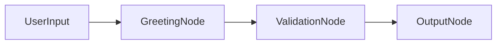

# PRD-006: Documentation & Developer Experience

**Status:** Planning  
**Priority:** P1 (Post-v2.0 Launch, Pre-Public Announcement)  
**Target Release:** v2.1.0  
**Dependencies:** PRD-001 through PRD-005 (all features complete)  
**Blocks:** Public launch, community growth, adoption

---

## Executive Summary

BackpackFlow v2.0 has become a **sophisticated framework** with:
- 5 major architectural components (Backpack, Telemetry, Serialization, Composite Nodes, Observability)
- Zod-based data contracts
- Nested flows and namespaces
- Complete event streaming
- 250+ tests

**Problem:** Without comprehensive documentation, developers will:
- ❌ Struggle to understand the architecture
- ❌ Miss powerful features (quarantine, snapshots, data mappings)
- ❌ Not adopt the framework (can't learn it)
- ❌ Ask repetitive support questions

**Solution:** Build a **Docusaurus documentation site** with:
- ✅ Getting Started guides
- ✅ Core Concepts explained
- ✅ API Reference (auto-generated)
- ✅ Real-world examples
- ✅ Best practices

---

## 1. Problem Statement

### 1.1 The "Where Do I Start?" Problem

New developer lands on GitHub README:
```
"BackpackFlow - TypeScript-first LLM framework"
npm install backpackflow
```

**Then what?**
- What's a Backpack?
- What's a BackpackNode?
- How do I create a flow?
- What's the difference from LangChain?

### 1.2 The "Hidden Features" Problem

We built amazing features that nobody knows about:
- 🔒 Access control on Backpack keys
- 📸 Time-travel debugging with snapshots
- 🧪 Quarantine API for state isolation
- 🔄 Data mappings on edges
- 📊 Zod contracts for validation
- 🔍 Namespace-based queries

**If developers don't know these exist, they won't use them.**

### 1.3 The "Bad Defaults" Problem

Without guidance, developers will:
- Not define data contracts (miss validation)
- Not use namespaces (lose organization)
- Not leverage telemetry (miss debugging tools)
- Recreate patterns we already solved

### 1.4 The "Trust Gap" Problem

Developers evaluate frameworks by documentation quality:
- Poor docs = "This is immature, don't use in production"
- Great docs = "This team is serious, I can trust this"

**Examples:**
- ✅ Stripe: Best-in-class docs → industry standard
- ✅ Vercel: Beautiful docs → massive adoption
- ❌ Many OSS projects: No docs → nobody uses them

---

## 2. Solution: Docusaurus Documentation Site

### 2.1 Why Docusaurus?

**Pros:**
- ✅ Built by Meta (React-based)
- ✅ Great developer experience
- ✅ Built-in search (Algolia)
- ✅ Versioning support (v2.0, v2.1, etc.)
- ✅ MDX support (interactive examples)
- ✅ TypeScript-friendly
- ✅ Fast, SEO-optimized
- ✅ Community loves it (React, Jest, Babel use it)

**Alternatives Considered:**
- VitePress: Good, but less features
- GitBook: Not developer-focused
- Just README: Too limited

**Decision:** Docusaurus 3.x

---

## 3. Documentation Structure

### 3.1 Site Architecture

```
backpackflow.dev/
├── Getting Started
│   ├── Installation
│   ├── Quick Start (5-minute tutorial)
│   ├── Your First Flow
│   └── Core Concepts Overview
│
├── Core Concepts
│   ├── 🎒 Backpack: State Management
│   │   ├── Pack & Unpack
│   │   ├── Access Control
│   │   ├── Quarantine API
│   │   ├── Snapshots & Time-Travel
│   │   └── Best Practices
│   │
│   ├── 📦 Nodes: Building Blocks
│   │   ├── BackpackNode Lifecycle
│   │   ├── Creating Custom Nodes
│   │   ├── Data Contracts (Zod)
│   │   ├── Namespace Segments
│   │   └── Node Composition
│   │
│   ├── 🔀 Flows: Orchestration
│   │   ├── Creating Flows
│   │   ├── Namespace Composition
│   │   ├── Edge Conditions & Routing
│   │   ├── Data Mappings
│   │   └── Nested Flows
│   │
│   ├── 📡 Telemetry: Observability
│   │   ├── Event Streaming
│   │   ├── Event Types (5 types)
│   │   ├── EventStreamer API
│   │   ├── Filtering by Namespace
│   │   └── Custom Event Handlers
│   │
│   └── 💾 Serialization: Config-Driven
│       ├── toConfig() & fromConfig()
│       ├── FlowLoader
│       ├── Dependency Injection
│       ├── JSON Schema Export
│       └── Versioning
│
├── Guides
│   ├── Building Your First Agent
│   ├── Adding Data Contracts
│   ├── Debugging with Telemetry
│   ├── Implementing Access Control
│   ├── Working with Nested Flows
│   ├── Testing Strategies
│   ├── Production Best Practices
│   ├── Performance Optimization
│   └── Error Handling Patterns
│
├── Examples
│   ├── YouTube Research Agent (Full Walkthrough)
│   ├── Chat Bot with Memory
│   ├── Multi-Agent System
│   ├── RAG Pipeline
│   ├── Validation Agent
│   └── More Examples...
│
├── API Reference
│   ├── BackpackNode
│   ├── Backpack
│   ├── Flow
│   ├── EventStreamer
│   ├── FlowLoader
│   ├── DependencyContainer
│   └── Types & Interfaces
│
├── Recipes
│   ├── Reusable Node Library
│   ├── Custom Event Handlers
│   ├── Dynamic Flow Generation
│   ├── State Rollback & Replay
│   ├── Multi-Tenant Isolation
│   └── Integration Patterns
│
├── Comparisons
│   ├── vs LangChain
│   ├── vs LangGraph
│   ├── vs n8n
│   └── When to Use BackpackFlow
│
└── Community
    ├── Contributing Guide
    ├── Code of Conduct
    ├── Roadmap
    ├── Changelog
    └── GitHub Discussions
```

---

## 4. Key Documentation Pages

### 4.1 Landing Page (backpackflow.dev)

**Hero Section:**
```
BackpackFlow
The TypeScript-first framework for building observable LLM agents

[Get Started] [View Examples] [GitHub]

✨ Zod-based data contracts
🔍 Complete observability
📦 Config-driven flows
🎯 Type-safe end-to-end
```

**Feature Highlights:**
- State Management with Backpack
- Real-time Telemetry
- Nested Flows & Composition
- Full Serialization Support

**Code Example:**
```typescript
// Show a simple but powerful example
```

### 4.2 Quick Start (5-Minute Tutorial)

**Goal:** Get developer from zero to working flow in 5 minutes.

```typescript
// Step 1: Install
npm install backpackflow zod

// Step 2: Create a node
import { z } from 'zod';
import { BackpackNode } from 'backpackflow';

class GreetingNode extends BackpackNode {
  static inputs = {
    name: z.string().describe('User name')
  };
  
  static outputs = {
    greeting: z.string().describe('Generated greeting')
  };
  
  async _exec() {
    const name = this.unpack('name');
    return `Hello, ${name}!`;
  }
  
  async post(shared, prep, result) {
    this.pack('greeting', result);
  }
}

// Step 3: Create a flow
const flow = new Flow({ namespace: 'demo' });
const node = flow.addNode(GreetingNode, { id: 'greet' });

// Step 4: Run it
flow.backpack.pack('name', 'World');
await node._run({});
console.log(flow.backpack.unpack('greeting')); // "Hello, World!"
```

**Result:** Developer has working code and understands the basics.

### 4.3 Core Concepts: Backpack

**Structure:**
1. **What is Backpack?**
   - State management solution
   - Git-like history
   - Access control built-in

2. **Basic Operations**
   ```typescript
   // Pack data
   backpack.pack('key', value, { nodeId, nodeName });
   
   // Unpack data
   const value = backpack.unpack('key', nodeId);
   
   // Unpack required (throws if missing)
   const value = backpack.unpackRequired('key', nodeId);
   ```

3. **Access Control**
   ```typescript
   // Key-based permissions
   backpack.setAccessControl({
     allowRead: { 'api-key': ['payment-node'] },
     allowWrite: { 'user-data': ['*'] }
   });
   
   // Namespace-based permissions
   backpack.setAccessControl({
     allowRead: { 'internal.*': ['admin-nodes.*'] }
   });
   ```

4. **Quarantine API**
   ```typescript
   // Isolate data for retry
   const quarantined = backpack.quarantine(['failed-data']);
   
   // Restore if needed
   backpack.restore(quarantined);
   ```

5. **Snapshots & Time-Travel**
   ```typescript
   // Get current state
   const snapshot = backpack.getSnapshot();
   
   // Diff between states
   const diff = backpack.diff(snapshot1, snapshot2);
   
   // Blame: who modified this key?
   const history = backpack.blame('user-query');
   ```

6. **Best Practices**
   - Use semantic keys (`user.query`, not `query`)
   - Leverage namespaces for access control
   - Take snapshots before risky operations
   - Use quarantine for retry loops

### 4.4 Core Concepts: Data Contracts (Zod)

**Why Data Contracts?**
- Runtime validation
- Type inference
- Self-documenting nodes
- UI auto-generation

**Example:**
```typescript
import { z } from 'zod';

// Define reusable schema
const UserSchema = z.object({
  id: z.string(),
  email: z.string().email(),
  name: z.string()
});

class UserNode extends BackpackNode {
  static inputs = {
    userId: z.string().uuid().describe('User ID to fetch')
  };
  
  static outputs = {
    user: UserSchema.describe('Fetched user data')
  };
  
  async _exec() {
    const userId = this.unpackRequired('userId');
    const user = await fetchUser(userId);
    return user;
  }
  
  async post(shared, prep, user) {
    this.pack('user', user);  // ✅ Validated against UserSchema!
  }
}

// Type inference works!
type User = z.infer<typeof UserSchema>;
```

**Benefits:**
- Catch errors before execution
- IntelliSense in your editor
- Automatic API documentation
- JSON Schema export for UIs

### 4.5 Examples: YouTube Research Agent

**Full Walkthrough:**
1. Problem: Analyze trending YouTube content
2. Solution: Multi-node flow with data contracts
3. Architecture diagram
4. Code walkthrough (each node)
5. Running the agent
6. Understanding the output
7. Customization ideas

**Key Learnings:**
- Reusable schemas (`YouTubeVideoSchema`)
- Channel-relative analysis
- LLM integration
- Event streaming for debugging

---

## 5. API Reference (Auto-Generated)

### 5.1 TypeDoc Integration

Use TypeDoc to generate API docs from TypeScript comments:

```typescript
/**
 * Pack data into the Backpack with metadata
 * 
 * @param key - Unique identifier for the data
 * @param value - Data to store (will be deep cloned)
 * @param options - Metadata options
 * @param options.nodeId - ID of the node packing this data
 * @param options.nodeName - Name of the node class
 * @param options.namespace - Namespace path
 * 
 * @example
 * ```typescript
 * backpack.pack('user-query', 'What is AI?', {
 *   nodeId: 'chat-1',
 *   nodeName: 'ChatNode',
 *   namespace: 'sales.chat'
 * });
 * ```
 * 
 * @throws {AccessDeniedError} If access control denies write
 */
pack(key: string, value: any, options: PackOptions): void {
  // ...
}
```

**Generated Output:**
- Class hierarchy
- Method signatures
- Parameter descriptions
- Return types
- Examples
- Errors thrown

### 5.2 API Reference Structure

```
API Reference
├── Classes
│   ├── BackpackNode
│   ├── Backpack
│   ├── Flow
│   ├── EventStreamer
│   ├── FlowLoader
│   └── DependencyContainer
│
├── Interfaces
│   ├── NodeConfig
│   ├── FlowConfig
│   ├── DataContract
│   ├── NodeContext
│   └── BackpackEvent
│
├── Types
│   ├── StreamEventType
│   ├── FlowAction
│   └── EdgeMappings
│
└── Errors
    ├── ContractValidationError
    ├── AccessDeniedError
    └── SerializationError
```

---

## 6. Interactive Examples (MDX)

### 6.1 Live Code Playground

Use MDX to embed runnable examples:

```mdx
import { BackpackNode, Flow } from 'backpackflow';

export function InteractiveExample() {
  const [result, setResult] = useState('');
  
  const runFlow = async () => {
    const flow = new Flow({ namespace: 'demo' });
    // ... run flow
    setResult(flow.backpack.unpack('output'));
  };
  
  return (
    <div>
      <button onClick={runFlow}>Run Flow</button>
      <pre>{result}</pre>
    </div>
  );
}

Try it yourself:
<InteractiveExample />
```

### 6.2 Diagrams (Mermaid)

Embed architecture diagrams:



---

## 7. Versioning Strategy

### 7.1 Documentation Versions

```
Versions:
├── v2.0 (Current)
├── v2.1 (Next)
└── Archive (v1.x - link only, "superseded")
```

### 7.2 Version Banner

When viewing old docs:
```
⚠️ You're viewing documentation for v2.0. 
The latest version is v2.2. [View latest] [See what's new]
```

---

## 8. Search & Discovery

### 8.1 Algolia DocSearch

**Features:**
- Instant search results
- Keyboard shortcuts (⌘K)
- Search across all versions
- Recent searches

### 8.2 SEO Optimization

**Meta tags for all pages:**
```html
<title>Backpack API - BackpackFlow Documentation</title>
<meta name="description" content="Learn how to use Backpack for state management...">
<meta property="og:image" content="/social-card.png">
```

**Result:** Rank high on Google for "TypeScript LLM framework"

---

## 9. Comparison Pages

### 9.1 vs LangChain

**Structure:**
| Feature | BackpackFlow | LangChain |
|---------|--------------|-----------|
| Type Safety | ✅ Full (Zod) | ⚠️ Partial |
| Observability | ✅ Built-in | ❌ External |
| State Management | ✅ Backpack | ⚠️ Memory only |
| Config-Driven | ✅ Yes | ❌ Code only |
| Learning Curve | Low | High |

**When to use BackpackFlow:**
- You need type safety
- You want observability
- You're building production agents
- You need to serialize flows

**When to use LangChain:**
- You need 1000+ integrations
- You're prototyping quickly
- You're in Python ecosystem

---

## 10. Community & Support

### 10.1 Contributing Guide

**Structure:**
1. Development setup
2. Running tests
3. Code style guide
4. PR process
5. Documentation guidelines

### 10.2 GitHub Discussions

**Categories:**
- 💡 Ideas (feature requests)
- 🙋 Q&A (community support)
- 📦 Show & Tell (built with BackpackFlow)
- 📢 Announcements

---

## 11. Metrics & Analytics

### 11.1 Track Documentation Usage

**Metrics to track:**
- Page views per section
- Search queries (what are people looking for?)
- Bounce rate (are docs helpful?)
- Feedback (👍 👎 on each page)

**Use insights to improve:**
- Most viewed = most important → keep updated
- High bounce = confusing → rewrite
- Common searches = missing content → add it

---

## 12. Implementation Plan

### Phase 1: Foundation (Week 1)
- [ ] Setup Docusaurus project
- [ ] Deploy to Vercel (backpackflow.dev)
- [ ] Migrate README content
- [ ] Create basic structure

### Phase 2: Core Content (Week 2-3)
- [ ] Getting Started guide
- [ ] Core Concepts (all 5)
- [ ] API Reference (TypeDoc)
- [ ] Basic examples

### Phase 3: Advanced Content (Week 4)
- [ ] All guides
- [ ] YouTube agent walkthrough
- [ ] Recipes
- [ ] Comparison pages

### Phase 4: Polish (Week 5)
- [ ] Algolia search
- [ ] SEO optimization
- [ ] Social cards
- [ ] Interactive examples

### Phase 5: Launch (Week 6)
- [ ] Final review
- [ ] Public announcement
- [ ] Community setup
- [ ] Monitor analytics

---

## 13. Success Criteria

**Launch Requirements:**
- ✅ All core concepts documented
- ✅ Getting started guide works (5-min tutorial)
- ✅ API reference complete
- ✅ At least 3 full examples
- ✅ Search working
- ✅ Mobile-friendly
- ✅ Fast (<2s load time)

**6-Month Goals:**
- 10,000+ monthly visitors
- <5% bounce rate on Getting Started
- 50+ GitHub stars from documentation alone
- 90%+ positive feedback on docs

---

## 14. Maintenance Strategy

### 14.1 Documentation as Code

**Requirements:**
- All code examples must work (run in CI)
- Update docs with every feature PR
- Version docs with releases
- Monthly review for outdated content

### 14.2 Community Contributions

**Accept PRs for:**
- Typo fixes
- New examples
- Clarifications
- Translations (future)

---

## 15. Future Enhancements (v2.2+)

### 15.1 Interactive Tutorials

**CodeSandbox integration:**
- Full tutorial in the browser
- No installation required
- Real LLM calls (with limits)

### 15.2 Video Content

**YouTube channel:**
- Getting started (5 min)
- Building your first agent (15 min)
- Deep dives (30 min each)

### 15.3 AI-Powered Search

**ChatGPT-style docs assistant:**
- "How do I implement access control?"
- AI searches docs + provides code
- Links to relevant pages

---

## 16. Inspiration (Best-in-Class Docs)

**Study these:**
1. **Stripe** - Best API docs ever made
2. **Vercel** - Beautiful, fast, clear
3. **Supabase** - Great examples and guides
4. **TanStack Query** - Excellent TypeScript docs
5. **Zod** - Simple but comprehensive

**Common patterns:**
- Clear navigation
- Code-first examples
- Search prominent
- Fast loading
- Beautiful design

---

## Conclusion

**Documentation is not optional for v2.0 success.**

We've built an incredibly powerful framework. Now we need to:
1. Make it **discoverable** (great docs rank high)
2. Make it **learnable** (clear guides)
3. Make it **trustworthy** (professional presentation)

**Next Steps:**
1. Approve this PRD
2. Create `docs/` folder structure
3. Setup Docusaurus project
4. Start with Getting Started guide
5. Launch backpackflow.dev

**Timeline:** 6 weeks to comprehensive docs
**Impact:** 10x adoption, community growth, production readiness

---

**Status:** Ready for review and approval 🚀

